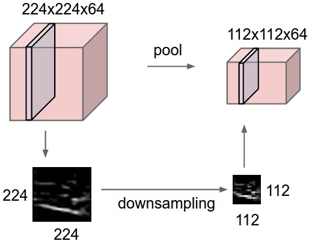

卷积神经网络
===========

## 结构介绍
当神经网络接收到一个输入后，通过一系列的隐藏层对其进行变换。每个隐藏层有一系列的神经元组成，每个神经元和之前的层的神经元相连，并且在每一层每个神经元相当于是相互独立的函数且彼此间不连接。最后一个全连接层成为输出层，并在分类问题中代表是分类的评分。
普通的神经网络在图像识别上不是很好。CIFAR-10图像集中，图片的大小只有32x32x3大小，因此在普通神经网络的第一个隐藏层全连接神经元将会有`32 * 32 * 3 = 3072`个权重。这个数量级看起来还不是很大，但是很明显的是全连接结构不适合大尺寸的图片。这是由于图像增大所需要更多的权重，参数的数量将会增长的特别快！并且，全连接是没有必要的，大量的参数也将会导致很快的过拟合。
卷积神经网络的输入可以为图片，并且能够使用更加合理的方式对框架进行约束。特别的，不想普通的神经网络，卷积网络在3维上组织神经元：**宽、高、深度**(这里使用深度一词并不是指整个网络的层数，而是指第三个维度)。例如，CIFAR-10作为输入的话，那么其体积为32x32x3，分别代表了长、高和深度。后面我们就会看到，一个层中的神经元并不是与之前所有的神经元进行连接的，而是仅仅和一部分进行连接。另外，CIFAR-10的输出层的维度为1x1x10，这是由于卷积网络结构将会将整张图片压缩成一个分类评分的向量，并作为深度的维度。下面给出可视化的例子：

  
  

左面是一个3层的神经网络，右面可视化了卷积网络结构神经元在三个维度上是如何排列的，可以看出卷积网络将3维输入经过神经元之后输出的也是3维的。

> A ConvNet is made up of Layers. Every Layer has a simple API: It transforms an input 3D volume to an output 3D volume with some differentiable function that may or may not have parameters.

## 卷积网络的各种层
正如上面描述的，一个简单的卷积网络由一系列的层顺序组成的，卷积网络的每一层通过不同的可微函数将一个体素的激活量转化成另一个。我们使用三个主要类型的层构建卷积网络：**卷积层、池化层**以及**全连接层**。
**卷积网络的一个例子**：我们将会为CIFAR-10分类问题构建一个简单的结构(INPUT-CONV-RELU-POOL-FC)。更多细节如下：
* INPUT[32x32x3]用来保存原有图像的像素值，这个例子中，图片宽高都是32，由RGB三个颜色通道。
* CONV层计算连接到输入中局部区域的神经元的输出，计算是权重和输入中较小局部区域的点积。结果是[32x32x12]大小，共有12层特征。
* RELU层将会对每个元素进行激活，使用$\max(0, x)$函数。这个部分不会对大小进行改变。
* POOL层作用相当于下采样操作，输出大小变为[16x16x12]。
* FC层将会计算分类的评分，输出大小为[1x1x10]，10个数代表分类的评分，正好对应CIFAR-10的10个类别。与普通的神经网络一样，该层中每个神经元会连接到上一层中所有的神经元。
从上面的结构可以看出，卷积网络将原始的图片一层一层的进行计算得出最终的分类评分。但是有些层是不包含任何参数的。特别的，CONV/FC层不仅仅是输入的函数，而且还是参数(神经元的权重和偏置)的参数。另一方面，RELU/POOL层是固定的函数。CONV/FC层的参数使用梯度下降的方式进行训练。下面给出一些总结：
* 卷积网络是通过一系列的层将图片输入转化成分类评分输出。
* 有很多不同类型的层：CONV/FC/RELU/POOL是比较常用的层。
* 每一层的输入都是3维数据，并使用一个可微函数将其转化成3维的输出。
* 并不是每一层都有参数，例如RELU/POOL就没有参数。
* 并不是所有层都有超参数，例如CONV/FC/POOL有但RELU没有。

上面给出了一个卷积网络的结构，这里最后的输出只可视化了5个分类的数据。

### 卷积层
卷积层是卷积网络中的重要组成部分，并产生了大量的计算量。
**基本概念**：卷积层相当于一系列可学习的滤波器组成的。每个滤波器在空间上(宽和高)都很小，但是深度和输入保持一致。例如，卷积网络在第一层的一个典型的滤波器的大小是5x5x3，代表有5像素宽和高，并且深度为3代表了三个颜色通道。在前向传播的时候，每个滤波器在输入数据的宽和高上进行滑动(这里指进行卷积操作)，然后计算整个滤波器和输入数据局部部分的点积。在滤波器进行滑动的过程中，将会产生代表滤波器在每个空间位置上输出的二维的激活映射。直观来说，网络当看到一些视觉特征的时候将会学习滤波器该如何进行激活，视觉特征诸如某些方位上的边界、某些颜色的斑点、甚至可以是网络更高层上的蜂巢状或者车轮状的图案。在每个卷积层上都有一系列的卷积核，每个卷积核都会产生一个二维的激活映射，最终将这些激活映射在深度的维度上叠加起来产生输出数据。
**生物上的比喻**：如果你喜欢用大脑和生物神经元来做比喻，那么输出的3D数据中的每个数据项可以被看做是神经元的一个输出，而该神经元只观察输入数据中的一小部分，并且和空间上左右两边的所有神经元共享参数（因为这些数字都是使用同一个滤波器得到的结果）。现在开始讨论神经元的连接，它们在空间中的排列，以及它们参数共享的模式。
**局部链接**：当处理像图片这样的高维的输入的时候，让每个神经元都和前一层的所有神经元进行全连接是不现实的。相反，我们让每个神经元只和输入数据的一个局部区域进行连接。该连接的空间大小是一个超参数，并称为神经元的*感受野*，也就是滤波器的大小，更一般的，本文中称为卷积核。在深度方向上，这个连接的大小总是和输入量的深度相同。再次强调：*对空间维度(宽和高)与深度维度的处理是不同的，连接在空间上是局部的，但在深度上总是和输入数据的深度相同。
  * *例1*，假设输入数据的大小为[32x32x3]，卷积核的大小为5x5，那么卷积层的每个神经元对应输入数据的[5x5x3]区域总共有5\*5\*3=75个权重和一个偏置参数。一定要注意深度为3，和输入保持一致。
  * *例2*，将设输入数据的大小为[16x16x20]，然后使用3x3的卷积核，卷积层的每个神经元会有3\*3\*20=180个权重。再次提醒深度要保持一致。

下面给出卷积神经网络的卷积操作和神经元的对比图：

  
  

**空间组织**：上面讲到了神经元是如何进行连接的，但是还没有讨论输出数据神经元的个数以及它们是如何进行组织的。有三个超参数控制着输出的大小：**深度、步长和零填充**。
1. 首先，输出的**深度**是一个超参数，对应着滤波器的数量，而每个滤波器在输入数据中关注不同的特征。例如，如果第一个卷积层的输入是原始图像，那么深度维度上不同的神经元可能被不同方向的边界、颜色斑点特征激活。
2. 其次，当对卷积核进行滑动的时候必须规定其**步长**。当步长为1的时候，每次滑动一个像素。当步长为2是，每次滑动两个像素，这个操作将会导致输出大小相对输入来说变小。
3. 有时，可通过对输入的边界填充0来保证输出和输入大小相同。**零填充**的尺寸是一个超参数。

输出的大小可以根据输入的大小进行计算，卷积层神经元的卷积核的大小为**F**，步长为**S**，在边上进行零填充的大小为**P**。假设输入的宽和高是相同的，那么输出数据的宽和高为$(W - F + 2P) / S + 1$。例如，输出是7x7，滤波器大小为3x3，步长为1，不进行填充，那么输出大小为5x5。下面给出一个图方便进行理解：

在图中，只有一个空间维度，神经元的卷积核F = 3，输出W = 5，零填充P = 1。左面的例子神经元的步长S = 1， 因此输出为(5 - 3 + 2) / 1 + 1 = 5。右面的例子中步长S = 2，因此输出大小为(5 - 3 + 2) / 2 + 1 = 3。在这个例子中，神经元的权重是[1, 0, -1]，偏差为0。这些权重被所有的神经元共享。

*使用零填充*：在上面左面的例子中，输入尺寸大小为5，输出的大小也是5，使用了3x3的接受域并使用尺寸为1的零填充。如果不使用零填充，那么输出的空间维度大小仅仅是3。一般来说，当步长为1的时候，将零填充设置为$P = (F - 1) / 2$能够使得输出和输入大小一致。使用零填充是非常常见的一种方式，后面再给出详细的原因。

*步长的限制*：注意空间排列的超参数之间是相互限制的。例如，当输入大小$W = 10$时，不使用零填充$P = 0$，并将卷积核设置为$F = 3$，那么我们不能使用步长$S = 2$，因为$(W - F + 2P) / S + 1 = (10 - 3 + 0) / 2 + 1 = 4.5$。结果不是整数，这就说神经元不能整齐对称的划过输入数据。因此，这种超参数的设定是无效的，但是可以通过修改零填充参数、修改输入数据的尺寸来使其合理，或者通过别的方式。总之，在构建卷积神经网络结构的时候，合理的设置网络的尺寸让所有的维度都能正常工作，这件事是相当让人头大的。而使用零填充和遵循其他一些设计策略将会有效解决这个问题。

*真实场景*：[Krizhevsky等人](http://papers.nips.cc/paper/4824-imagenet-classification-with-deep-convolutional-neural-networks)网络结构赢得了2012年的ImageNet挑战，使用图片的大小为[227 x 227 x 3]。在第一个卷积层，使用卷积核大小为$F = 11$，步长为$S = 4$，不使用零填充。因此(227 - 11) / 4 + 1 = 55，卷积层的深度为$K = 96$，因此第一个卷积层的输出为[55 x 55 x 96]。每个输出的神经元都连接到输入的大小为[11 x 11 x 3]的局部区域。另外，在每个深度列上的96个神经元都连接到输入的相同的局部区域上，但是权重不同。但在原文中，输入图像的大小为224 x 224，显然是错误的，毕竟`(224 - 11) / 4 + 1`不是一个整数。这件事在神经网络的历史上困扰了很多人，但是没人知道到底是怎么发生的这个错误。可能是Alex忘记在论文中提到使用了尺寸为3的零填充。

**参数共享**：为了降低卷积层参数的数量。使用上述真实的例子说明：第一层共有`55 * 55 * 96=290400`个神经元，每个神经元有`11 * 11 * 3 = 363`个权重以及一个偏置。总计`290400 * 364 = 105705600`个参数，这显然是非常高的。
我们可以做一个理想的假设：如果在空间位置`(x, y)`上，某个特征用处很大，那么在另一个位置`(x2, y2)`上也是很有用的。话句话说，将单独的二维区域看成是深度维度上的一个**深度切片**，在每个深度切片上使用相同的权重和偏置来减少参数的数量。上面给出的例子中第一个卷积层就会有96个不同的权重和偏置，总计有`96 * 11 * 11 * 3 = 34848`个不同的权重，`96`个偏置，共计`34848 + 96 = 34944`个参数。在每个深度切片中的`55 x 55`个权重使用相同的参数。在反向传播的时候，都要计算每个神经元对它权重的梯度，但是需要把同一个深度切片上的所有神经元对梯度进行累加，以此来计算共享权重的梯度，进而每个切片只更新一个权重集。
注意有的时候参数共享的假设是没有意义的，特别是当卷积神经网络的输入图像是一些明确的中心结构的时候。这个时候我们就希望卷积网络在不同的位置能够学得不同的特征。例如，假如输入的图像是人脸，人脸一般都在图像的中间位置，那么就希望能够学习眼睛或者头发等不同位置的特征。这个时候就应该放松对参数共享的限制，这样的层就叫做**局部连接层**。

**使用Numpy**：为了能够更清晰的理解卷积层，让我们使用numpy来实现上述思想。假设输入数据是numpy数组`X`。那么：
* 位于`(x, y)`的深度列为`X[x, y, :]`。
* 在深度为d的切片或者是激活映射为`X[:, :, d]`。
假设输入`X`的大小为：`X.shape = (11, 11, 4)`。不适用零填充，卷积核的大小为5，步长为2。输出大小为`(11 - 5) / 2 + 1 = 4`。那么输出数据中的激活映射(`V`)看起来就是下面这样：
* `V[0, 0, 0] = np.sum(X[ : 5, :5, :] * W0) + b0`
* `V[1, 0, 0] = np.sum(X[2: 7, :5, :] * W0) + b0`
* `V[2, 0, 0] = np.sum(X[4: 9, :5, :] * W0) + b0`
* `V[3, 0, 0] = np.sum(X[6:11, :5, :] * W0) + b0`
在numpy中，`*`操作是将每个元素进行相乘。`W0`是神经元的权重向量，`b0`是偏置。这里的`W0`的尺寸为`W0.shape = (5, 5, 4)`表示卷积核的大小为5，深度为4。注意对每一个点，计算点积的方式和之前的普通神经网络是一样的。同时，可以看到在计算内积的时候使用的是同一个权重和偏差，使用步长为2。为了构建输出的第二个激活映射，使用下面代码计算得出：
* `V[0, 0, 1] = np.sum(X[ : 5,  : 5, :] * W1) + b1`
* `V[1, 0, 1] = np.sum(X[2: 7,  : 5, :] * W1) + b1`
* `V[2, 0, 1] = np.sum(X[4: 9,  : 5, :] * W1) + b1`
* `V[3, 0, 1] = np.sum(X[6:11,  : 5, :] * W1) + b1`
* `V[0, 1, 1] = np.sum(X[ : 5, 2: 7, :] * W1) + b1` (在y方向上)
* `V[2, 3, 1] = np.sum(X[4: 9, 6:11, :] * W1) + b1` (在同时两个方向上)
我们访问的是`V`的深度上的第二层，由于计算的是第二个激活映射，那么这次使用的参数便是W1。在上面的代码中，为了简洁略去了卷积层对输出数组`V`中其他部分的操作。另外，这些卷积操作通常后面接的是ReLU层，对激活映射中每个元素使用激活函数进行映射。

**小结**：
* 输入数据尺寸为$W_1 x H_1 x D_1$
* 超参数：
  * 卷积核的数量$K$
  * 卷积核的大小$F$
  * 步长$S$
  * 零填充的大小$P$
* 输出尺寸的大小$W_2 x H_2 x D_2$
  * $W_2 = (W_1 - F + 2P) / S + 1$
  * $H_2 = (H_1 - F + 2P) / S + 1$
  * $D_2 = K$
* 使用参数共享，每个卷积核产生$F * F * D_1$个权重，总共产生$(F * F * D_1) * K$个权重以及$K$个偏置
* 在输出数据中，第$d$个深度切片(大小为$W_2 x H_2$)

**使用矩阵乘法实现**：卷积运算的本质是卷积核和输入数据的局部部分做*点积*。卷积层的常用实现方式就是利用这一点，将卷积层的前向传播变成一个巨大的矩阵乘法：
1. 输入图像的局部区域通常使用`im2col`的操作拉伸成列。例如，输入为[227 x 227 x 3]，对齐使用11 x 11 x 3的卷积核并使用步长为4进行卷积操作，那么就取输入大小为11 x 11 x 3的数据块，然后将其拉伸为长度为11 x 11 x 3 = 363的列向量。重复进行这一过程，由于使用步长为4，那么输出的尺寸为(227 - 11) / 4 + 1 = 55，因此使用*im2col*操作的输出矩阵`X_col`的尺寸为[363 x 3025]，每一列都拉伸成感受野，总共有55 * 55 = 3025个感受野。由于感受野有重叠，因此输入数据中在很多不同的列中会有重复的数据。
2. 卷积层的权重也类似的拉伸成行。例如，有96个大小为[11 x 11 x 3]的卷积核，那么被拉伸成的矩阵`W_row`的大小为[96 x 363]。
3. 卷积的结果现在就跟大矩阵的乘法`np.dot(W_row, X_col)`相同了，这样就能够得出每个卷积核和感受野的点积。点积的输出结果为[96 x 3025]，代表了卷积核在每个位置的点积结果。
4. 结果最后重新调整为合适的输出维度[55 x 55 x 96]。
这个方法由于在`X_col`中会重复的复制输入数据，将占用很大的内存。但是对矩阵乘法有很有有效的算法能够降低内存占用并提升计算效率。

**反向传播**：卷积操作的反向传播，还是一个卷积操作。
**1x1的卷积操作**：一些论文中使用了1x1的卷积操作，最初在[Network in Network](http://arxiv.org/abs/1312.4400)论文中提及。有些人最初对此感觉到很困惑，尤其是做信号处理的人。由于处理的信号是2维的，因此1x1的卷积操作就没有意义了。但是在神经网络中并不是这样，因为这里是对三个维度进行操作，滤波器和输入数据深度是一样的。例如，如果输入是[32 x 32 x 3]，那么1x1的卷积就是对3维进行高效的点积。

**扩张卷积**：最新的研究([Fisher Yu和Vladlen Koltun的论文](https://arxiv.org/abs/1511.07122))给卷积层引入了一个称为扩展的超参数。以前的研究都是基于连续卷积核的。但是，让卷积核中元素中间有间隙也是可以的，这个就被称为扩展。例如，在某个维度上的卷积核`W`大小为3，那么对于输入`x`的计算如下：`w[0] * x[0] + w[1] * x[1] + w[2] * x[2]`，那么扩张为0。当扩张为1的时候，计算就变成`w[0] * x[0] + w[1] * x[2] + w[2] * x[4]`。在某些场景中，扩张卷积和正常卷积是非常有用的，以便在很少的层数内更快地汇聚输入图片的大尺度特征。例如，上下重叠两个3x3的卷积层，那么第二个卷积层的神经元的感受野是输入数据体中5x5的区域（可以成这些神经元的有效感受野是5x5）。如果我们对卷积进行扩张，那么这个有效感受野就会迅速增长。

### 池化层
通常都会在连续的卷积层中加入池化层。它的作用是减少空间的尺寸以此来减少参数的数量，也能够防止过拟合。池化层对每个深度切片进行独立的操作，使用MAX函数来减少数据的大小。普遍的让方式使用2x2的滤波器以步长为2进行降采样，那么将会减少75%的大小。每个MAX操作对4个数(在深度切片中2x2的区域)取最大值。深度维度的大小保持不变。更一般的，有如下结论：
* 输入大小为$W_1 x H_1 x D_1$
* 需要两个超参数：
  * 空间大小$F$
  * 步长$S$
* 输出大小为$W_2 x H_2 x D_2$
  * $W_2 = (W_1 - F) / S + 1$
  * $H_2 = (H_1 - F) / S + 1$
  * $D_2 = D_1$
* 该操作不会引入任何的参数
* 一般不使用零填充

**普通池化**：除了最大池化，池化单元也能使用其他方式，像*平均池化*和*L2-norm池化*。平均池化之前经常使用，但是现在基本上都使用最大池化来替代了，事实也表明最大池化的效果更好。下面给出了池化操作的图像说明：

  
  

**反向传播**：回想反向传播的内容，`max(x, y)`的操作的简单解释是仅仅将输入的最大值进行向后传播。因此，在反向传播的时候，只需要反向传播最大值的激活即可。

**摆脱池化**：很多人不喜欢池化操作，并且认为我们能够避免使用池化。例如，[Striving for Simplicity: The All Convolutional Net](http://arxiv.org/abs/1412.6806)提出弃用池化层，而只是用卷积层。为了能够减少大小，建议在卷积层中使用大的步幅就能达到目的。像variational autoencoders(VAEs)和generative adversarial networks(GANs)，发现弃用池化层在训练出良好的生成模型中也起着重要作用。因此，未来的结构中可能不会出现池化层或者很少使用池化层。

### 归一化层
在卷积网络结构中很多类型的归一化层被提出，有些甚至想要实现在大脑中观察到的抑制的现象。但是，这些层由于效果并不是很好，目前大部分都不再受欢迎了。对于各种类型的归一化层，请参考Alex Krizhevsky’s [cuda-convnet library API](http://code.google.com/p/cuda-convnet/wiki/LayerParams#Local_response_normalization_layer_(same_map))。

### 全连接层
神经在全连接层中将会连接到前一层的所有激活中。可以通过矩阵乘法以及偏置偏移来计算它的激活。具体，参考神经网络部分。

**将全连接层转化成卷积层**：值得注意的是，全连接层和卷积层的区别是卷积层仅仅连接到输入的局部区域并在很多神经元中共享参数。但是，这两个层中的神经仍然都使用点积运算，都是用类似的函数。因此，将全连接层转成卷积层是有可能的：
* 对于任何的卷积层，都能使用一个全连接层来实现相同的前向传播函数。权重矩阵中除了一些由于局部连接导致的特殊区域(这些区域大部分由于参数共享都是相同的)外，大部分都是0。
* 反过来，任何的全连接层都能转化成卷积层。例如，全连接层$K = 4096$，输入的大小为$7 \times 7 \times 512$可以使用卷积层进行替代：$F = 7, P = 0, S = 1, K = 4096$。
上面的两种替换中，*将全连接层转成卷积层*在实际应用中是相当有用的。假设卷积网络使用224x224x3的图片作为输入，并使用一系列的卷积层和池化层将图片减少成7x7x512的激活输出。然后使用两个大小为4096的全连接层，最后使用1000个神经元的全连接层来获得最终的分类评分。我们可以将这三个全连接层按照上面的论述转化成卷积层：
* 第一个全连接层：输入为[7x7x512]，使用$F = 7$的卷积层进行替换，得到的输出同样为[1x1x4096]。
* 第二个全连接层：使用$F = 1$的卷积层进行替换，得到的输出同样为[1x1x4096]。
* 最后的全连接层：使用$F = 1$的卷积层进行替换，得到的最终输出同样为[1x1x1000]。
上面的转化在实际中可以加入对权重的矩阵的变形。实际证明，这种转化能够在较大的图片上更有效的进行滑动。例如，将224x224的图像变成大小为7x7x512，大小变小了32倍。然后将大小为384x384的图像输入到网络中，输出的大小就变成了12x12x512。接下来将会进入3个卷积网络(上面给出用来替代全连接层的)得到最终的输出大小为(12 - 7) / 1 + 1 = 6。并不是最终分类的评分大小1x1x1000，现在得到了6x6的评分矩阵。
> 上面的操作相当于对于384x384的图像输入，使用全连接层的卷积网络以32像素的步长独立对图像中的224x224块进行多次评价。其效果和使用卷积层替代全连接层的卷积网络进行一次前向传播是一样的。
很显然，使用卷积层替代全连接层的卷积网络比对所有的36个位置进行迭代计算更有效。这一技巧在实际中经常使用，一次来获得更好的结果。比如，通常将一张图像尺寸变大，然后使用变换后的卷积网络对空间上很多不同位置进行分类评分，然后对这些评分求平均值。
最后，如果我们想用步长小于32像素的滑动窗该怎么办？用多次的前向传播就可以解决。例如，我们使用16像素的滑动窗口，可以通过将替代的卷积网络前向传播两次：首先对原图进行前向传播，然后第二次对图片在宽和高上平移16像素然后进行前向传播，最终将两次输出结合即可。下面给出了使用caffe进行具体变换的代码：[Net Surgery](https://github.com/BVLC/caffe/blob/master/examples/net_surgery.ipynb)。

## 卷积网络的结构
上面讨论了卷积网络的常见的不同类型的层，以及ReLU激活函数来对元素进行非线性操作。下面将讨论如何构建卷积网络。

### 层的构建
最常见的卷积网络的结构是堆叠一系列的CONV-RELU层，然后加入POOL层。重复这种模式知道图像在空间上大小变得足够小为止。在某个地方过渡成成全连接层也较为常见。从最后的全连接层获得输出，一般是分类的评分。也就是说，最常见的网络结构如下所示：
`INPUT -> [[CONV -> RELU]*N -> POOL?]*M -> [FC -> RELU]*K -> FC`
`*`代表重复，`POOL?`代表是可选的池化层。一般`0 <= N <= 3, M >= 0, 0 <= 0 < 3`。下面给出一些按照这种模式构建的卷积网络：
* `INPUT -> FC`，线性分类器：`N = M = K = 0`。
* `INPUT -> CONV -> RELU -> FC`
* `INPUT -> [CONV -> RELU -> POOL]*2 -> FC -> RELU -> FC`，在每个池化层之间有一个卷积层。
* `INPUT -> [CONV -> RELU -> CONV -> RELU -> POOL]*3 -> [FC -> RELU]*2 -> FC`，在池化层之前有两个卷积层，这种方式适用于较深的大型网络：由于池化层容易破坏数据，而多层卷积层容易从输入数据中学得更多的特征。

**使用小卷积核**
几个小卷积核的卷积层胜过使用一个大卷积核的卷积层。假设使用三个3x3的卷积层，注意每层之间都有非线性的激活函数。在这种组织下，第一层卷积层的每个神经元的感受野为3x3。第二层卷积层的神经元也是3x3的感受野，但相较于输入来说，感受野扩展到了5x5。类似的，第三层卷积层相较于输入来说，感受野的范围扩展到了7x7。如果使用一个7x7接受域的卷积层代替上面三个卷积层，虽然这些神经元的感受野相较于输入来说也是7x7的，但是有一些缺点。首先，这些神经元对输入做线性变换，但是三层卷积层可以做一些非线性变换来获取更好的特征。其次，假设我们又$C$个通道，那么7x7的卷积层将会有$C \times (7 \times 7 \times C) = 49 C^2$个参数，而三个3x3的卷积层仅仅引入$3 \times (C \times (3 \times 3 \times C)) = 27 C^2$个参数。因此，使用几个小卷积核的卷积层堆叠相对于使用单个大卷积核的卷积层来说提取的特征更好，且引入的参数较少。但是比较不好的一点是在反向传播的时候将会占用大量内存。

**最新进展**
传统的将层按照线性的方式堆叠起来的做法收到了挑战，谷歌的Inception结构以及微软亚洲研究院的Residual网络都使用了非线性的堆叠方式。能够提取更为复杂的特征。
在实际使用中，选取卷积网络结构是一件令人头疼的工作，但让人庆幸的是90%多的结构都是可以工作的。而且还有一点，不要想着做一个创始者，而是将目前最新的网络结构下载下来，使用他训练出来的模型，并在自己的数据上进行微调。这里给出一些视频资料：[Deep Learning school](https://www.youtube.com/watch?v=u6aEYuemt0M)。

### 层的大小
1. 输入层的大小：应该能被2整除多次，常见的大小为32(CIFAR-10)、64、96(STL-10)、224(常用的ImageNet卷积网络)、384以及512。
2. 卷积层的大小：尽量使用小卷积核，如3x3和5x5。使用步长为1，并且记得使用零填充来保证输出空间上的大小和输入相同。如果使用大的卷积核，则只会在原始图片上使用。
3. 池化层的大小：池化层主要是将数据进行缩放。最常用的是2x2的接受域，并使用2作为步长。这一操作将会丢弃掉输入75%的激活量。接受域很少有大于3的，毕竟接受域太大会导致数据信息的丢失，使得算法的性能变差。

**减少尺寸设置问题**：上面讨论的是卷积层维持输入的空间大小，只是用池化层进行降采样操作。另一种方案是卷积层采用步长大于1且不使用零填充的卷积层，那么对于尺寸的问题要格外小心了，要确保步长以及卷积核的大小互相吻合，使得各层网络对称的恰好连接在一起。
**使用步长为1的卷积**：实际使用中，小的步长能够工作的更好。另外，使用步长为1的卷积核来保证尺寸不会变化，让池化层进行降采样操作，卷积层仅仅对深度进行变换。
**使用零填充**：使用零填充能够使输出数据和输入数据在空间维度上保持一致，还能够提高算法性能。如果卷积层不适用零填充，那么就可能丢失掉图片的边缘信息。
**内存限制**：在某些案例中，基于前面的规则，内存的使用量可能会飙升。例如，使用64个尺寸为3x3的卷积核对224x224x3的图像进行卷积，使用大小为1的零填充，得到的输出为224x224x64。输出的激活量将达到上千万，也就是要使用72MB的内存。很有可能就会由于内存问题而导致GPU运算能力降低，所以必须做出一些妥协。实际使用中，人们倾向于在网络的第一个卷积层中做出妥协。例如，第一个卷积层使用步长为2，大小为7x7的卷积核。在AlexNet中，使用步长为4，大小为11x11的卷积核。
