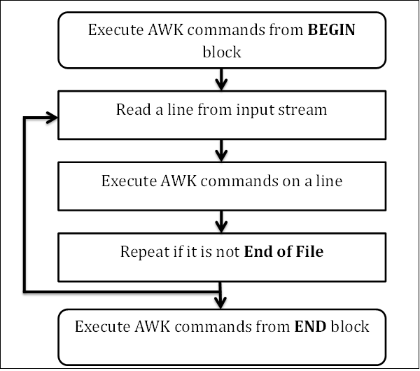

Awk
===

介绍参考 [wikipedia](https://en.wikipedia.org/wiki/AWK)

工作流
---



图片来至于<https://www.tutorialspoint.com/awk/awk_workflow.htm>

`AWK`从输入流（文件、管道以及`stdin`）读取数据到内存中，然后按照上述的流程，先执行`BEGIN`块内的命令，然后循环读取每一行并执行`AWK`的命令，直到读取结束。最后执行`END`块内的命令。


命令的组件
---

### BEGIN 块

```
BEGIN {awk-commands}
```

`BEGIN`块内的命令是在程序启动的开始执行的，只能够执行一次，一般可以用来声明一些变量。这个块命令是可选的，不是必须的。

### Body 块

```
/pattern/ {awk-commands}
```

该部分是主要的部分，当`awk`程序读取每一行的时候，都会执行该部分的命令，你可以使用严格的模式来匹配出你想要处理的内容。

### End 块

```
END {awk-commands}
```

`END`块在程序结束的时候执行，也是执行一次，是可选的部分。

### 一个小例子

有以下文件`marks.txt`，包含数字，名字，以及学科和分数：
```
1)  Amit    Physics  80
2)  Rahul   Maths    90
3)  Shyam   Biology  87
4)  Kedar   English  85
5)  Hari    History  89
```

执行命令：
``` shell
awk 'BEGIN{printf "Sr No\tName\tSub\tMarks\n"} {print}' marks.txt
```

得到的输出：
```
Sr No Name Sub Marks
1) Amit Physics 80
2) Rahul Maths 90
3) Shyam Biology 87
4) Kedar English 85
5) Hari History 89
```

基本语法
---

### 命令行形式

1. 基本的命令行： `awk [options] file`
1. 可以将命令保存到一个文件中，使用`-f`指定保存命令的文件：
   ``` shell
   awk [options] -f file ...
   ```

### 标准的选项

1. `-v`选项：这个选项用来对参数进行赋值：
   ``` shell
   awk -v name=Jerry 'BEGIN {printf "Name = %s\n", name}'
   ```
   输出为：`Name = Jerry`

1. `dump-variables[=file]`选项：将全局变量的最后结果输出到文件中，默认的文件名为`awkvars.out`
   ``` shell
   awk --dump-variables ''
   cat awkvars.out
   ```
   输出的结果（节选）：
   ```
   ARGC: 1
   ARGIND: 0
   ARGV: array, 1 elements
   BINMODE: 0
   CONVFMT: "%.6g"
   ...
   ```

1. `--lint[=fatal]`选项：该选项能够设置检查命令的级别，但设置为`fatal`的时候将警告信息看作是错误
   ``` shell
   awk --lint '' /bin/ls
   ```
   输出结果：
   ```
   awk: cmd. line:1: warning: empty program text on command line
   awk: cmd. line:1: warning: source file does not end in newline
   awk: warning: no program text at all!
   ```

1. `--profile[=file]`选项：该命令能够将命令保存到一个文件中，以便后面方便使用。默认保存到`awkprof.out`文件中
   ``` shell
   awk --profile 'BEGIN{printf"---|HEADER|--\n"} {print} END{printf"---|Footer|---\n"}' marks.txt > /dev/null
   cat awkprof.out
   ```
   输出结果为：
   ```
      # gawk profile, created Tue Jun 11 10:37:05 2019

      # BEGIN block(s)

      BEGIN {
         printf "---|HEADER|--\n"
      }

      # Rule(s)

      {
         print $0
      }

      # END block(s)

      END {
         printf "---|Footer|---\n"
      }
   ```

1. `--trainditional`选项：禁用扩展的选项，只能够指用原生的功能。

内置参数
---

| 变量名 | 说明 | 示例 |
| :---: | --- | --- |
| ARGC | 给出命令行参数的个数 | `awk 'BEGIN {print "Arguments =", ARGC}' One Two Three Four` |
| ARGV | 所有的参数集合 | `awk 'BEGIN {for (i = 0; i < ARGC - 1; ++i) { printf "ARGV[%d] = %s\n", i, ARGV[i] }}' one two three four` |
| CONVFMT | 数字的格式，默认`%.6g` | `awk 'BEGIN { print "Conversion Format =", CONVFMT }'` |
| ENVIRON | 环境变量集合 | `awk 'BEGIN { print ENVIRON["USER"] }'` |
| FILENAME | 当前的文件名 | `awk 'END {print FILENAME}' marks.txt`
| FS | 域分隔符，用来将输入记录分割成域，默认为空格或Tab | `awk 'BEGIN {print "FS = " FS}' | cat -vte` |
| NF | 域的计数，可使用`$NF`引用最后一个域 | `echo -e "One Two\nOne Two Three\nOne Two Three Four" | awk 'NF > 2'` |
| NR | 已输入记录的条数 | `echo -e "One Two\nOne Two Three\nOne Two Three Four" | awk 'NR < 3'` |
| FNR | 和上一条命令相似，主要用于多文件的处理中，该值每个新文件开始的时候都会重置 |  |
| OFMT | 输出数字的格式，默认为`%.6g` | `awk 'BEGIN {print "OFMT = " OFMT}'` |
| OFS | 输出域分隔符，默认为空格 | `awk 'BEGIN {print "OFS = " OFS}' | cat -vte` |
| ORS | 输出记录分隔符，默认为换行符 | `awk 'BEGIN {print "ORS = " ORS}' | cat -vte` |
| RS | 当前的记录分隔符，默认状态下，输入的每行都看看作一个记录，默认的记录分隔符为换行符 | `awk 'BEGIN {print "RS = " RS}' | cat -vte` |
| RLENGTH | `match`函数匹配到字符串的长度 | `awk 'BEGIN { if (match("One Two Three", "re")) { print RLENGTH } }'` |
| RSTART | `match`函数匹配到字符串的开始位置 | `awk 'BEGIN { if (match("One Two Three", "Thre")) { print RSTART } }'` |
| SUBSEP | 数组的分隔符，默认为`\034` | `awk 'BEGIN { print "SUBSEP = " SUBSEP }' | cat -vte` |
| $0 | 代表输入的整个记录 | `awk '{print $0}' marks.txt` |
| $n | 代表第几个域，域使用`FS`分割 | `awk '{print $3 "\t" $4}' marks.txt`

控制流
---

1. `if` 语句
   ```
   if (condition)
      action

   if (condition) {
      actions
   }
   ```

1. `if else`语句
   ```
   if (condition)
      action
   else
      action
   ```

1. `if else-if`语句
   ```
   if (conditon)
      aciton
   else if (action)
      action
   ```

循环语句
---

1. For
   ```
   for (initialization; condition; increment/decrement)
      action
   ```

1. While
   ```
   while (condition)
      action
   ```

1. Do-While
   ```
   do
      action
   while (condition)
   ```

内置函数
---

### 数学操作函数

* `atan2(y, x)`
* `cos(expr)`
* `exp(expr)`
* `int(expr)`
* `log(expr)`
* `rand()`
* `sin(expr)`
* `sqrt(expr)`
* `srand([expr])`

### 字符串操作函数

* `asort(arr [, d [, how] ])`：对字符串进行排序
   ``` shell
   awk 'BEGIN {
      arr[0] = "Three"
      arr[1] = "One"
      arr[2] = "Two"
      print "Array elements before sorting:"
      
      for (i in arr) {
         print arr[i]
      }
      asort(arr)
      print "Array elements after sorting:"
      
      for (i in arr) {
         print arr[i]
      }
   }'
   ```
   输出：
   ```
   Array elements before sorting:
   Three
   One
   Two
   Array elements after sorting:
   One
   Three
   Two
   ```

* `asorti(arr [, d [, how] ])`：使用`index`排序
   ``` shell
   awk 'BEGIN {
      arr["Two"] = 1
      arr["One"] = 2
      arr["Three"] = 3
      asorti(arr)
      print "Array indices after sorting:"
      
      for (i in arr) {
         print arr[i]
      }
   }'
   ```
   输出
   ```
   Array indices after sorting:
   One
   Three
   Two
   ```

* `gsub(regex, sub, string)`：使用`sub`替换正则表达式匹配的字符串。`string`是可选的，如果该值不出现，则将使用`$0`作为默认值。
   ``` shell
   awk 'BEGIN {
      str = "Hello, World"
      print "String before replacement = " str
      
      gsub("World", "Jerry", str)
      print "String after replacement = " str
   }'
   ```
   输出：
   ```
   String before replacement = Hello, World
   String after replacement = Hello, Jerry
   ```

* `sub(regex, sub, string)`：这种方式仅仅将第一个匹配到的字符进行替换。

* `index(str, sub)`：`sub`如果是`str`的一部分，则返回其索引（从`1`开始计数），否则返回`0`。

* `length(str)`

* `match(str, regex)`：返回正则表达式匹配到最长字符串的索引，如果匹配失败返回`0`。

* `split(str, arr, regex)`：将字符串按照`regex`的方式进行分割，然后存储到`arr`数组中。

* `printf(format, expr-list)`

* `strtonum(str)`：将字符串转化成数字，`0nnn`表示八进制，`0xnnn`表示十六进制。

* `substr(str, start, l)`：返回从`start`到`l`的子字符串。

* `tolower(str)`

* `toupper(str)`

### 时间处理的函数

* `systime()`：返回系统当前的时间
   ``` shell
   awk 'BEGIN {
      print "Number of seconds since the Epoch = " systime()
   }'
   ```

   结果：
   ```
   Number of seconds since the Epoch = 1560233663
   ```

* `mktime(datespec)`：给定时间格式 `YYYY MM DD HH MM SS`，返回时间戳。
   ``` shell
   awk 'BEGIN {
      print "Number of seconds since the Epoch = " mktime("2014 12 14 30 20 10")
   }'
   ```
   结果为
   ```
   Number of seconds since the Epoch = 1418604610
   ```

* `strftime([format [, timestamp[, utc-flag]]])`：使用特定的时间格式打印
   ``` shell
   awk 'BEGIN {
      print strftime("Time = %m/%d/%Y %H:%M:%S", systime())
   }'
   ```
   输出结果：
   ```
   Time = 06/11/2019 14:17:11
   ```

   时间格式的定义如下：
   1. `%a`：当地星期名称的简写
   1. `%A`：当地星期名称的全写
   1. `%b`：当地月份名称的简写
   1. `%B`：当地月份名称的全写
   1. `%c`：当地日期和时间一起的简写
   1. `%C`：年份的前两位
   1. `%d`：日期
   1. `%D`：相当于`%m/%d/%y`
   1. `%e`：日期，当只有一个数字的时候，增加一个空格保证两位数
   1. `%F`：相当于`%Y-%m-%d`
   1. `%g`：年份的后两位
   1. `%G`：年份
   1. `%h`：相当于`%b`
   1. `%H`：24小时制的小时
   1. `%I`：12小时制的小时
   1. `%j`：本年内的第几天
   1. `%m`：月份
   1. `%M`：分钟
   1. `%n`：新的一行`LF`
   1. `%p`：显示`AM`或`PM`
   1. `%r`：相当于`%I:%M:%S %p`
   1. `%R`：相当于`%H:%M`
   1. `%S`：秒
   1. `%t`：`TAB`
   1. `%T`：相当于`%H:%M:%S`
   1. `%u`：一周的第几天，周一为第1天
   1. `%U`：一年的第几周，按照周天开始算
   1. `%V`：一年的第几周，按照周易开始算
   1. `%w`：一周的第几天，周天为第0天
   1. `%W`：一年的第几周，从0开始，周一作为一周的第一天
   1. `%x`：当地日期的简单表示
   1. `%X`：当地时间的简单表示
   1. `%y`：年份的后两位
   1. `%Y`：年份
   1. `%z`：时区的表示`+HHMM`
   1. `%Z`：时区的名称

二进制计算
---

* `and`
* `compl`：按位取反，相当于`1F FFFF FFFF FFFF - num`。例如`compl(10) = 9007199254740981`
* `lshift`
* `rshift`
* `or`
* `xor`
