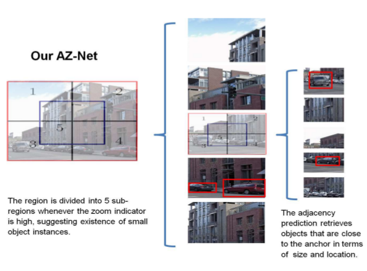
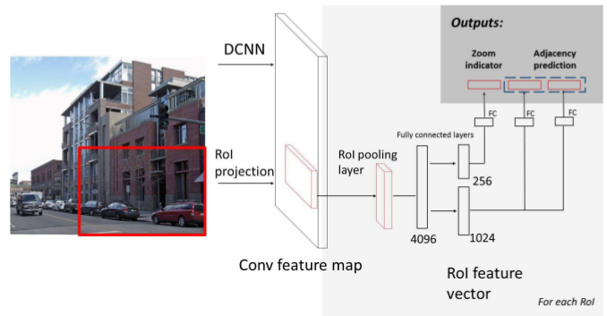
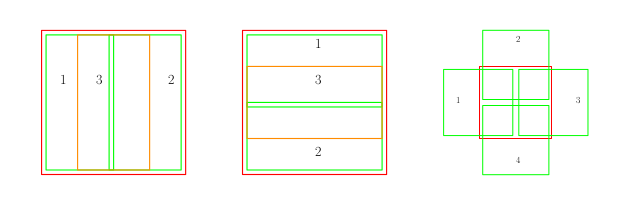

Adaptive Object Detection Using Adjacency and Zoom Prediction
===

基本介绍
---

这个方法是从`Fast RCNN`修改而来的，主要是解决*区域推荐部分*的算法。在基于推荐的算法中，第一个步骤是产生推荐区域，第二个步骤是将这些推荐区域送入到分类器算法中进行分类。本文的主要贡献在于第一个步骤：如果能够产生更为精确的推荐区域，那么能够大大的增加计算的速度，同时能够增强检测的能力，毕竟这类算法还是很依赖于推荐区域的。

产生区域推荐算法的主要思想如下图所示：

从上图可以看出，主要是使用递归的思想，如果图像完全包含一个目标，那么就是用递归的方法持续的重复该步骤，直到图像中不再存在目标位置。使用这种方法，能够检测较小的目标。

整体的网络架构如下：

从上面的框架可以看出，该算法使用了**共享计算**的概念，先从整张图像提取特征图，然后使用对于每个区域进行映射，使用`RoI Pooling`将子区域对应的特征提取成相同大小的特征图并最终抽象成特征向量。特征向量分为两个分支，一个分支作为预测，另一个分支来决定该区域是否需要划分成多个子区域。

实现细节
---

### 网络结构

该网络是基于`Fast RCNN`修改而来的，主要的更改在于第一个阶段的区域推荐部分。区域推荐不再是使用滑窗的方式产生大量的候选框，而是将整张图像不断的分割，直到该区域能够较为紧凑的包裹目标位置，这样能够减少大量的冗余计算。另外，在结果的输出部分，虽然和`Fast RCNN`较为类似，但是多处一个分支输出的二值结果来确定是否需要进一步的对子区域进行分割。另一个分支则是依据`sub-region prior`产生一系列的候选框，并给出每个候选框的置信度。

### 结果输出

**Zoom Indicator**的结果主要是用来表示该区域是否需要进一步进行划分，当目标的`50%`的部分都落在该区域并且目标所占的区域不超过`25%`该值为`1`，也就是说主要关注的是该区域存在目标并且在该区域中所占的比例较小，需要经过进一步的裁剪才能更为紧凑的包裹该目标。由于该值是一个二值结果，很容易就造成了过拟合，因此在训练的过程中需要加入一定量的噪声。

**Adjacency Prediction**主要是为了得到一系列的边界框及其这些框的置信度。这部分结果和`Fast RCNN`较为类似。边界框的产生是相对于`sub-region prior`产生的，需要像RCNN一样需要对结果进行映射以产生更为精确的位置。另外，每个框都要输出分类的置信度，来表示该候选框可能属于的分类。

### sub-region prior

在`Fast RCNN`中，使用滑窗的技术来产生区域推荐框，在每个位置上产生多种尺度、多种。在预测的过程中，预测的结果是基于`sub-region prior`的，关于该部分的示意图如下：

上图左侧是垂直条纹，中间是水平条纹，右侧是和相邻的四个角的方块。红色的矩形框达标是图像，数字标出的几个框代表的是`sub-region prior`。实际上两个相邻的框并没有中间的间隔，而是紧密相连的。实际上使用这种方式，主要是为了能够检测出更多宽高比例的目标，以及能够模拟出更多的位置。另外，需要需要不断的对图像进行分割，那么这就解决了多尺度的问题。

### 损失函数的设计

损失函数分为两个部分：一个部分是是否需要进行划分的`Zoom Indicator`，该部分使用`sigmoid`产生结果，使用**二值的交叉损失函数**。另一个部分是预测部分，边界框的损失函数依然使用**smooth L1**损失函数，对于置信度也是使用**多分类的交叉损失函数**。最终的损失函数是这三个部分的总和。

总结
---

这篇文章的使用**基于区域推荐的检测算法**，其工作主要是基于**Fast RCNN**，修改了**区域生成**的步骤，主要是能够产生更为精确的位置。
基于区域推荐的检测算法要求产生的推荐区域有以下几个特点：
1. 尽可能的具有多个尺度
1. 尽可能的具有多种宽高比例
1. 尽可能的覆盖到目标所在的位置

该文章针对上面三种情况的解决方案是：
1. 不断的将图像进行分割成多个子区域，这样就能够将小目标进一步方法，监测到较小尺度的目标。
1. 最终的检测结果是基于`sub-region prior`的，采用了类似于`anchor`机制的三种比例来检测较高的、较宽的、接近于正方形的目标。
1. 同上的处理，在每种比例的`sub-region prior`中，都会有多个位置，这样能够覆盖到该区域中所有的位置。再加上不断地进行分割，那么位置能够做到特别的精细。

这篇文章在区域生成的部分的算法是十分新颖的，能够较好的解决小目标检测的问题，挺值的细细品读的。
