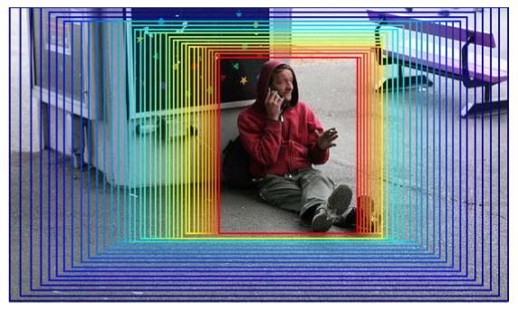
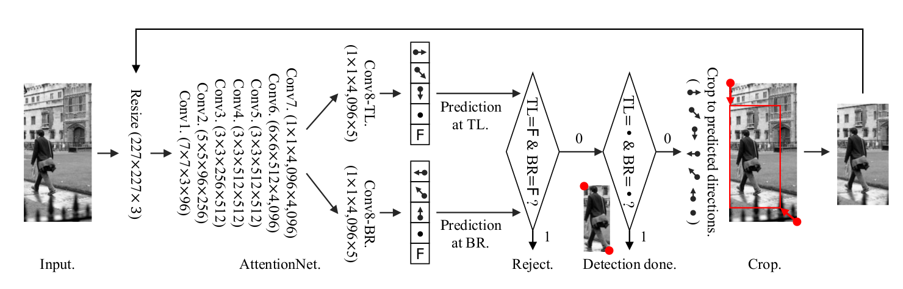
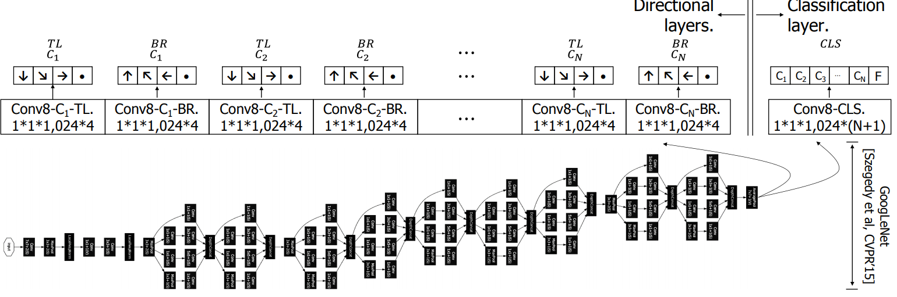
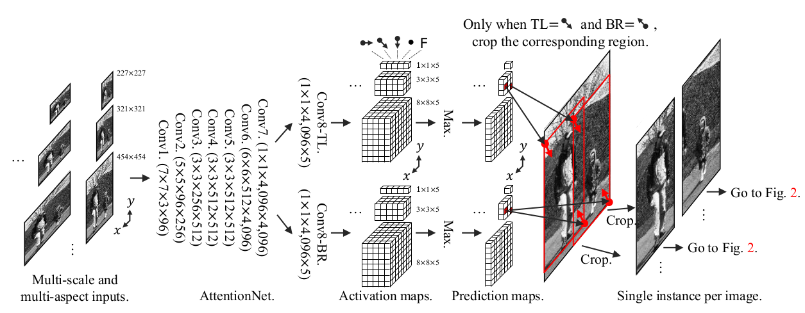
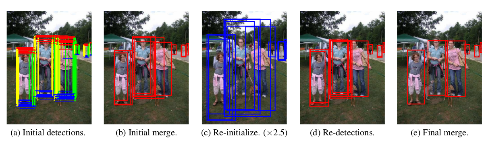

AttentionNet: Aggregating Weak Directions for Accurate Object Detection
===

相关介绍
---

该论文提出将现有的**目标存在的评估**以及**目标边界框优化**集成到一个网络里面。提出了回归方式进行检测的模型，该模型集成了较好的分类模型而不是回归模型。并将很多弱的分类器集成起来形成一个强的分类器，并进行了修改，使得网络能够提图像中存在的目标相较于整张图像而言，左上角和右下角的量化的方向。

下图给出`AttentionNet`的一个例子：

依据上图，`AttentionNet`从整张图像开始，根据网络预测出的左上角及右下角的量化方向，递归的对图像进行裁剪然后再次放入到网络中进行预测，直到边界框能够恰好的框住目标物体。*虽然给出的预测方向可能是不稳定的，但是集成起来的预测结果足够确定目标的准确位置。该文章提出，使用分类的模型来解决回归模型无法一次预测准确的位置的问题，但对于图像中有多个目标的网络，提出了滑窗的算法来解决这个问题。

该网络模型不包括任何的分支模型以及边界框的回归后处理，`AttentionNet`能够做到：
* 检测区域内包含的单个目标；
* 在每个区域提供该目标的大致位置；
* 通过边界框回归方式来纠正位置。

但是该网络存在很多问题，比如该网络对于多种分类的扩展性较差。

**贡献**：
1. 通过集成弱预测器来评估准确的边界框。
1. 网络中不包括像区域推荐、目标分类以及边界框回归后处理这样任何分开独立的模型，网络能够做这所有的一切。
1. 在单个分类目标检测任务中，能够达到当时最好的结果。

检测算法
---

### 检测算法

将输入的图像调整成网络所有的固定的输入大小，然后输入到`AttentionNet`。该网络输出目标的左上角以及右下角的两个点位置相较于整张图片的左上角及右下角的位置的方向。左上角点的输出的状态为：**向右、向右下、向下、停止不动以及该图像不存在目标**。对于上图中，网络预测的状态为：*左上角向下，右下角向左上*。然后根据方向来对原来的输入图像进行裁剪生成新的生成图像，输入到网络中。一直重复该步骤，直到输出的状态为**停止不动**位置。假如两个点都输出**不存在目标**，那么检测的结果为不存在目标物体。

### 优点

1. 基于区域推荐的算法产生的区域通常都会将目标裁开，因此得到的结果也不是很好。
1. 使用分类模型的`softmax`损失函数，而不是使用回归算法中常用的平方损失函数。
1. 虽然使用的分类算法仅仅能够提供比较粗略的预测，但是随着整个流程的迭代，最终能够逼近目标。

### 网络结构

如上面的图所示，不使用`pooling`以及`normalization`层。
> 实际上，查阅了相关资料，前面的特征提取层依然使用池化操作。论文中提到特征提取使用可VGG-M的结构，略有修改。但是可以换成其他的特征提取网络。

原论文中，特征提取之后的特征图连接到`Conv8`中，分两个分支来获得左上角和右下角的方向，将其看作一个分类的算法，最终输出每个状态的概率大小。仅仅输出方向，这也就是说分类必须是提前限制好的，只能够检测特定的分类。后面有些工作作了修改，两个分支去掉`不存在目标`的状态，输出为4个状态。另外再接一个分支来获得每个类别的概率值。结构如下图所示：

训练
---

为了能够更好的给出例子，需要对数据进行增强。主要分为以下几个部分：

**随机产生 positive 区域**：主要是为了能够模拟方向的所有样本
1. 区域必须包含50%的目标。
1. 区域内可以包含多个目标，但是主要的目标要占据更大的面积。要求主要目标占据的空间是其他目标的**1.5**倍。
1. 区域使用多种比例以及尺度进行裁剪。

**多目标场景**：使用多目标的场景主要是为了能够使得最终的结果能够紧贴目标，而不会将多个目标融合成一个目标
1. 主要是要选取 **negative** 区域。该区域不和目标分类的边界框有任何重叠，同样要使用多种比例和多种尺度进行裁剪。

最终，对于 **positive** 和 **negative** 两种样例要平衡。对于一个批量而言，当有`16`个样例的时候，`negative`区域应占据`1/(2x16)`，这里是因为前面对于左上角和右下角分别有`4`中情况，那么一共有`4x4=16`种情况。这里使用的损失函数使用左上角和右下角两个分类的`softmax`损失的平均值。
> 对于改写的网络而言，输出分为两个大部分：方向以及分类的概率。最终的损失函数是这三个部分分类`softmax`损失函数的平均值。

多目标下的扩展
---

之前提出，检测从整张图像开始，然后递归的向目标逼近，这种方式仅仅对单个目标而言合适，对与图像中的多个目标就十分不合适了。解决这个问题的方式就不再从整张图像开始，而是先产生候选区域，从候选区域开始向目标进行逼近。候选区域应该满足训练的 `positive` 区域的限制条件。

**候选区域的生成**：对于图像中的任意一个子区域，如果将该区域作为输入，那么得到结果共有17中可能（左上角和右下角各有4种目标存在状态，加上一个不存在目标的状态）。其中只关注（**左上角方向为右下、右下角方西为左上**）着一种状态，因为其他状态可能存在目标被截断的情况，只有这种状态说明该区域明确的存在一个完整的目标。为了能够加速产生这些候选区域，不是遍历所有的子区域，而是使用**滑窗的方式**。这里也不是使用常规的滑窗方式，而是将图像的输入改成**321x321**大小的，输入到网络中，能够得到`3x3x5`的特征图，对应于`227x227`图像上的不同位置（位置是怎么映射的还没完全搞懂，后续找一下源码）。文中提出使用不同比例，不同尺度的图像进行训练，能够得到更多的候选区域，这样基本上能够定位到图像中所有的目标。

整个框架如下图：

在多个目标的检测中，得到的结果如下：

