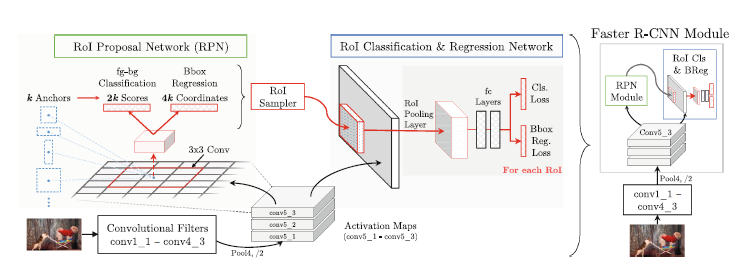
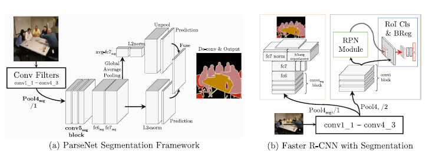
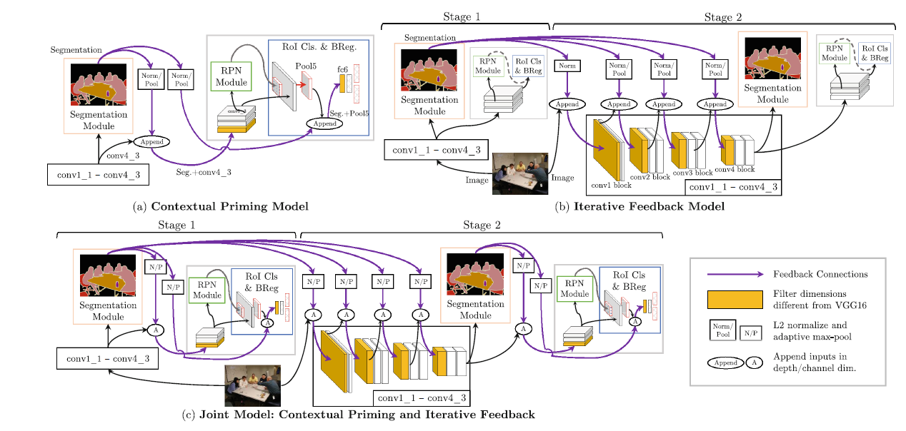

Contextual Priming and Feedback for Faster R-CNN
===

基本介绍
---

文章针对之前`Faster R-CNN`的基本检测流程，给出了以下几个尝试：

- 使用自上而下的信息来产生推荐区域。特别的，加入了语义分割的信息来产生自上而下的信息，另外使用语义分割的信息能够提供详细的上下文信息。
- 整个网络自上而下的进行反馈，以便能够从所有的层提取特征。使用分割信息作为网络的输入，自上而下的反馈，能够引导网络将注意的中心放到目标的区域上。

因此，针对上面的尝试，作者提出的网络由以下几个部分：

- **Semantic Segmentation Network**：将`Faster R-CNN`扩展到分割领域，用来给网络提供分割信息。
- **Contextual Priming via Semantic Segmentation**：区域推荐和目标检测模块都是前馈的，作者提出使用语义分割信息给这些模块提供从上而下的前馈，能够使区域推荐及目标检测模块拥有更好的性能。
- **Iterative Top-Down Feedback**：使用分割信息向低级提供自上而下的反馈，并在第二个阶段的`Faster R-CNN`中向底层的卷积网络中提供反馈。

实现方式
---

### Faster R-CNN

首先介绍以下`Faster R-CNN`网络的结构，示意图如下所示：

如上图所示，该网络总共风味两个部分：第一部分将图像作为输入，产生**感兴趣区域(RoI)**；第二部分使用`Fast R-CNN`的检测和分类模块。特征提取的部分都是使用`VGG-16`，共有13个卷积层以及2个全连接层。

### Faster R-CNN with Segmentation

作者将`Faster R-CNN`算法进行扩展，加入了分割的部分，网络结构如下图所示：

加入的分割算法应该具有以下的特点：

1. 速度快；
1. 使用和`Faster R-CNN`相同的结构，方便进行集成；
1. 尽量不使用后处理，能够更好的和`Faster R-CNN`进行集成。

上面的左图显示了`ParseNet`的分割算法，使用全连接卷积神经网络。没有后处理的步骤，使用全剧平均值的将不同尺度的特征归一化。

依据`ParseNet`的特点，增加分割部分之后如上图右侧部分。基于之前的`Faster R-CNN`网络，修改如下：

1. 在`conv4_3`提取特征之后的池化操作不再进行下采样。
1. 在卷积层`conv5 block`之后，加入了`1x1 1024 channel`的卷积操作
1. 使用全局平均值池化的方式将`(H x W x D)`的特征图，得到每个通道的平均值，以此来计算`unpools`的特征。
1. 输出的结果进行合并，然后使用`8x`的反卷积获取和原有大小相同的输出结果。

网络设计完成，训练过程有几个关键的问题：

1. `Faster R-CNN`能够处理任意尺寸的图像，但是`ParseNet`只能够接受`500 x 500`的图像。因此需要将分割的部分设计成能够处理任意尺寸输入的模块。
1. `Faster R-CNN`和`ParseNet`使用不同的超参数进行训练，需要单独进行微调。因此在训练的过程中，需要针对分割模块和共享层修改超参数。

### Network Architecture

最终网络的设计如下：

整体分为两个主要的部分:

1. **Contextual Priming Model**：该部分模型参见上图左上角部分，分割和`Faster R-CNN`共享使用底层提取出来的特征，但是两个部分的`conv5 block`卷积部分不再是共享的。另外，由于`RoI Pooling`的操作，检测模块仅仅是使用分割特征的局部特征。因此为了能够共享各部分的特征，将`seg + pool5`提取出来的特征抽象成特征向量然后再输入到`fc6`。
1. **Iterative Feedback Model**：该部分如上图右上角部分，重点在于在每个卷积块操作都将原有的输入和分割的信息进行融合作为输入。
1. **Joint Model**：将上面两个部分组合起来，如上图的下半部分区域，分为两个阶段的工作。第一个阶段，使用图像提取特征图，然后分为两个分支：一部分用来进行分割，另一部分进行进行`Faster-RCNN`的操作，不过在连接层`fc6`之前融入了分割的特征。第二个阶段，同样使用图像作为输入，在提取卷积的特征的时候，将分割的特征融入进去。最终产生的特征图依然分为两个部分，一部分产生分割特征，另一部分进行`Faster-RCNN`的操作，同样会在连接层`fc6`之前融入提取的分割特征。
