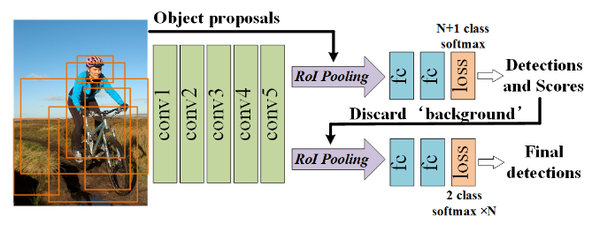

CRAFT Objects from Images
===

基本介绍
---

`CRAFT`：Cascade Region-proposal-network And FasT-rcnn

本文主要是将最新提出的`RPN`网络和`Fast RCNN`网络相结合来进一步提升检测的准确性。在大多数基于区域推荐算法的网络中，区域推荐生成的质量将会影响检测的准确性，本文先使用`RPN`网络来产生大量的推荐区域，然后使用`Fast RCNN`对这些推荐区域进行检测，去处大量不可靠的推荐区域，然后再级联一个`Fast RCNN`用来最终确实该区域是否真的包含目标。

网络实现
---

整体的网络如下图所示：

正如介绍部分所讲的，图像作为输入，使用特征提取网络进行特征的提取，使用最新的`RPN`网络给出推荐的区域，然后先使用一个`Fast RCNN`的网络获得这些区域的分类结果。由于大部分的推荐区域都是背景的分类，因此该步骤将会去除大部分不可靠的推荐区域。后面还是使用相同的`Fast RCNN`来获得一个二分类的结果，来确定该部分是否真的存在目标，得到最后的检测结果。

在训练的时候，同样是非常麻烦的：
1. 使用滑窗的算法产生推荐区域，然后对`RPN`网络进行训练。
1. 对`RPN`网络训练过后，对于每张图像，大致能够产生2000个推荐的区域。使用这些区域去训练后面的分类网络。其中`IoU`大于0.7的作为正样本，而小于0.3的作为负样本。

在测试的时候，首先要运行`RPN`网络产生2000个推荐区域，使用推荐区域和图像作为输入，经过第一个`Fast RCNN`网络，大致能够生于`300`个推荐的区域。最终经过后一个`Fast RCNN`，能够得到更为精确的结果。

总结
---

本论文，使用了两个`Fast RCNN`进行级联，前一个网络主要获得每个推荐区域的分类，从而保留有效的推荐区域。后一个网络则是最终判断该区域是否真的存在目标。经过两个网络的级联，能够有效的提升网络的鲁棒性。但是本文在算法的创新点上并没有那么突出，两个网络的级联在时间上将会增加大量的成本。
