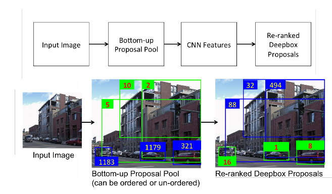

DeepBox: Learning Objectness with Convolutional Networks
===

基本介绍
---

**自下而上的推荐**：实际上就是**RCNN**中使用的额推荐区域的概念。文中提出有两个主要的优点：减少了搜寻的区域，能够更加准确的进行识别；降低假正率，使得检测更为简单。

文中提出以下框架的检测模型：

给定任何一张RGB的图像，都先产生自下而上的推荐区域。然后使用CNN提取的特征进行重新排序，排名较高的显示为绿色，较低的显示为蓝色。使用4层的神经网络框架来对推荐的区域进行重新的排序，使得排序的算法更为简单高效。另外，使用了*SPP*以及*Fast RCNN*中的一些思想。文中提出了两个结论：确实存在通用的语义概念；这些语义概念可以很容易的通过轻型的CNN学习得到。

网络结构
---

DeepBox包含两个步骤：
1. 产生`N`个自下而上的推荐区域，并且该推荐算法仅仅关注很可能存在目标的推荐。
1. 使用`CNN`网络进行提取特征，然后根据提取的特征对所有的区域进行重新排序。

### 特征提取网络

CNN网络使用`AlexNet`的网络模型，但是为了能够提高计算的速度，对其进行了修改。为了能够更快的进行计算，可以减少不同层的通道数；可以移除一些层；可以减少输入图像的维度，但是最终得到的特征图是粗略的。经过文章的各种实验，修改后的网络框架为：`conv(kernel_size=11, channels=96, stride=4)` => `pool(kernel_size=3, stride=2)` => `conv(kernel_size=5, channels=256, stride=1)` => `fc(channels=1024)` => `fc(channels=2)`。除了最后一层外，每一层都是用`ReLU`作为激活函数。最终得出的结果是表示是否为目标物体的*二分类*结果，所以通过`softmax`计算得到两个结果的概率。输入图像的大小为`140x140`。

### 共享计算

为了能够加快计算，采用共享计算的方式。共享计算是指，之前的区域推荐算法都需要将图像进行裁剪，针对每个部分计算特征图。然而这种计算方式是很浪费了，重叠的区域的计算是重复的。因此可以直接输入整张图像，然后对得到的特征图进行映射。关于映射的关系，实际上特征图可以看成是对原有图像的缩放，那么对于每个推荐的区域来讲，也是缩放到成对于的特征子区域，按比例进行缩放即可。

### 空间金字塔池化

由于推荐的区域是大小和宽高比都是大不相同的，而需要得到最终一致的特征向量，可以使用**SPP**的方式得到固定长度的特征向量。同时，SPP的论文指出，训练的时候，需要使用多种尺度进行训练，该文章也尝试使用不同的尺度的图像作为输入进行训练。

训练部分
---

训练分为两个阶段：第一个阶段主要是为了能够将含有目标的边界框和随机产生的只有背景的边界框区分开。第二个阶段主要进行微调来获得更好的结果。两个步骤中正反例的比例都控制在`1:3`，动量设置为`0.9`，权重的衰变摄制成`0.0005`，最初的学习率摄制成`0.001`，每`20,000`个迭代降低到原来的`0.1`。批量大小为`128`。

1. **使用滑窗进行训练**：首先通过光栅扫描(raster scanning)的方式产生不含有目标的窗口。滑窗的步长采用*Edge Boxes*文章中的参数。每个位置都产生5中不同比例(`1:1, 2:3, 1:3, 3:2, 3:1`)的推荐区域。产生的框和标注的框的重叠区域应该小于`0.5`。下一步就是产生含有目标的框，对标注框的左上角和右下角的点的坐标进行随机变化来得到新的框，变化的范围限定在一定的范围之内。

2. **在困难的反例上进行训练**：经过第一部的训练，网络基本上能够得到一个比较好的结果。该步骤主要是进行微调来获得更稳定的结果。该训练不再像之前的步骤那样产生推荐区域，而是借用了*Edge Boxes*中产生推荐的算法，这些推荐的区域中能够包含更多的**边、纹理等**特征。同时，将重叠区域大于`0.7`设置为正例，那么网络能够更为细致的区分较为*紧凑*和*稀疏*的框。而将重叠区域小于`0.3`的框设置为反例，介于两个阈值之间的不参与训练，以免降低网络的稳定性。

总结
---

该文章使用`AlexNet`作为特征提取网络。文章使用整张图像的特征图来共享计算，并使用**SPP**的操作将每个特征图计算出固定大小的特征向量。使用特征向量产生该框中是否存在目标物体，而不是给出每个分类的值。该文章的一个主要思想是对推荐的区域进行重新排序，最终的分类是也是根据之前的`AlexNet`特征得来的。另外，该网络整体是从`Fast R-CNN`的代码修改而来的，其整体的思想都是继承自之前的工作。
