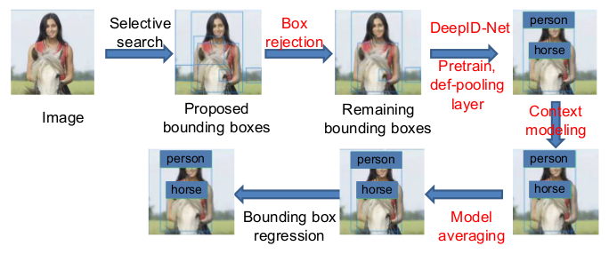
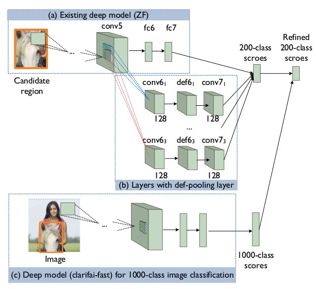
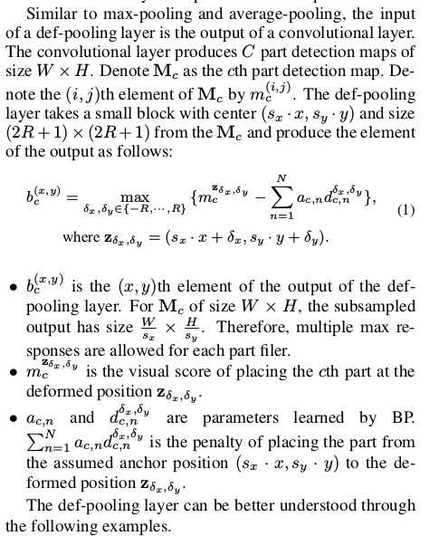

DeepID-Net: Deformable Deep Convolutional Neural Networks for Object Detection
===

本文的主要贡献在于：

1. 新的目标检测框架，整合了**特征提取、部分可变性学习、上下文模型、模型平均、位置微调**等多个模块。该网络能够生成多个具有多样性的检测器，使用有效的模型平均的方式进行融合。
1. 提出了训练网络新的方案。先使用`ImageNet`大量的数据进行训练，然后再在目标的数据集上进行训练。使用大规模的数据集进行训练，能够很好的对权重进行初始化。
1. 提出了新的池化方法，`Deformation Constrained Pooling (def-pooling)`。通过在任何特征层上学习对象部分的可变形来丰富深度模型，能够学得更多的可变形信息。

部分可变形在目标检测领域是比较关键的一个部分：

* 可变形的视觉模型可以检测多个目标。例如很多目标都是圆形的，可以使用同样的视觉模型去匹配。
* 视觉模型在不同的语义层次上，可变形存在一定的规律。
* 高层次的可变形特征可以由低层次的可变形特征组成，能够向下进行细分。

整体的框架
---

整体的方案如下图所示：

1. 选择搜索推荐产生候选区域。
1. 使用已有的检测器（作者使用了 `RCNN` ），用来将背景的候选区域去除掉。
1. 将候选框进行裁剪，然后使用 `DeepID-Net` 进行检测，得到200个检测的评分。评分对对应了该区域存在特定分类的概率。
1. 将模型得到的1000个分类的评分结果作为上下文信息，来微调上一步骤产生的概率以及每个候选区域的位置。
1. 将多个模型的输出进行平均，用来提高检测的准确率。
1. 使用回归算法进一步对位置信息进行精确，减小位置的误差。

DeepID-Net
---

该模型总共拥有三个部分：

* 已有的特征提取网络模型。
* 使用 `def-pooling` 得到多个分支，每个分支作为独立的检测器对结果进行检测。
* 使用已有的特征提取网络得到1000个分类的概率，作为上下文信息对分类和位置的结果进行微调。

该部分的详细的图如下所示：

关于 `def-pooling` 操作的描述如下图：

该方式具有以下的优势：

* 能够替代任何的卷基层，并学习部分的形状和深层的语义信息。
* 能够使得相同的视觉特征拥有多种变形。
* 不同的分类之间，使用的模型可能相同，能够在不同的分类之间共享。

总结
---

该作者主要是将原始的数字图像处理算法和深度学习算法进行结合，提出了 `def-pooling` 的操作。
