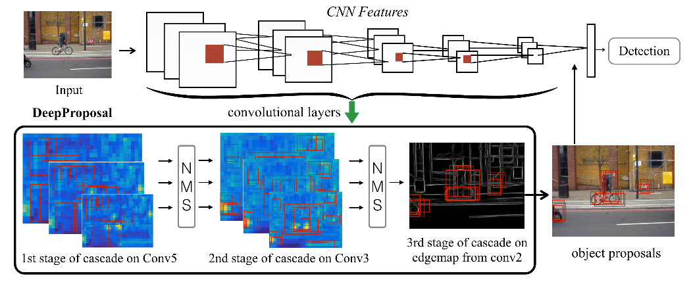

DeepProposal: Hunting Objects by Cascading Deep Convolutional Layers
===

这篇论文基于滑窗的方法，使用卷积神经网络提取出来的特征，从粗略到细致的来检测图像中可能存在的目标。主要的框架如下：

基本方法
---

### 滑窗

如果在每个位置都产生不同比例不同大小的候选框，那么将大大增加计算的复杂度。因此文中提出要选取一系列的窗口大小，而不是对所有的窗口大小都进行尝试。由于数据集是同分布的，那么可以对训练集进行分析。文中规定尺度的范围为`1..20`，宽高比例的范围`1..20`，使用最大化`recall`的方式确定选取的尺度和比例的组合，最终得出选取前`50`个组合能够得到较好的结果又能够节省计算时间。

### 多尺度

从框架的图中可以看出，使用了多个尺度的特征图。但是为了能够覆盖更多的目标，需要使用多种尺度的图像进行训练，文中提出使用`227,300,400,600`四种尺度的图像进行训练。

### 金字塔模型

使用平均池化将会损失一些几何特征，因此可以及那个推荐的窗口划分成相同大小的子窗口，对每个子窗口都得到不同的表示。

### 大小和比例的便移

目标总是以一定的大小和比例出现的，因此增加了三个维度`(w, h, w*h)`，其中，`w`和`h`分别是窗口的宽和高。最终让`SVM`学习特定的尺寸包含那种目标。池化的特征和尺度相关的特征分别使用`l2`范数来进行标准化。

### 分类器

我们分别针对每个尺度训练线性分类器。对于特定的尺度，随机选出`10个`和标注的框的重叠区域超过`70%`的区域作为正样本；随机选出`50个`和标注的框重叠区域低于`30%`的区域作为负样本。使用`线性的SVM`分类器，主要基于速度上的考量。

### 非极大值抑制

最终的生成的框需要使用通用的方法进行非极大值抑制。对于非极大值抑制的阈值，需要进行微调。

### 特征提取网络

特征提取网络使用`AlexNet`，没有经过什么修改。

### 逆向的级联

使用逆向级联的方式使用特征图对边界框进行处理，以便消除包含相同目标的边界框。在一些论文中指出，最后一层的特征图虽然拥有较强的语音信息，但随着下采样的原因导致位置较为粗略。而前几层的特征图则在位置上损失没有那么严重，但语义信息不丰富。因此文章使用这一特性，先使用最后一层来削减重复的边界框，然后依次进行级联，最终来确定精确的位置。

1. **在第五层特征图上进行稠密的滑动窗口算法**：该文中使用的滑窗是在最后一个特征图上进行的，按照前面所描述的，在每个位置上产生50个不同大小和比例的候选框。虽然金字塔的表示能够增强性能，但是文章不推荐使用这种方式来增加计算的复杂性。在该步骤中，将评价得分线性的映射到`0-1`之间，最终使用*非极大值抑制的算法*选出`4000`个候选框传递给下一个阶段。
1. **在第三层特征图上对候选框进行重新排序**：该步骤会增加几何信息，通过使用金字塔的表示，将其分为两个层次：`1x1`以及`1x2`。最终的评分重新进行映射到`0-1`之间，最终的评分是上次评分和这次两个层次评分的乘积之和。最终筛选出3000个候选的框。最这个阶段的最后，使用非极大抑制的方式最终选出`1000`个候选框。
1. **在第二层特征图上进行位置的精调**：文中提出使用该层的特征图使用`DeepContour`的方式来产生图像的边界信息，利用边界信息使用贪婪算法对推荐的框在不同位置和不同尺度上获得最大的评分。该步骤不再使用非极大值抑制的方式，而主要的目的是对位置上的调整，以使得包含相同目标的边界相差不是很大。

总结
---

本文主要是构造一个**反向级联**，从CNN的最终卷积层到最初的卷积层，一步步的将候选框从粗略到精确的进行过滤，最终得到确定的位置。
