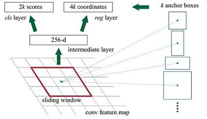

Faster RCNN
===========

arXiv：<https://arxiv.org/abs/1506.01497>

基本介绍
-------
Faster RCNN是对之前*RCNN*以及*Fast RCNN*的改进，将**Feature Extraction**、**Proposal**、**ROI**、**Regression**和**Classfication**等模块整合到同一个网络上去，使得在效率上有了极大的提升。
首先，论文给出Faster RCNN基本结构图如下：

根据上图可以看出，Faster RCNN主要分为以下几个部分：
1. **Conv Layers**：使用深度学习框架(VGG，ResNet等)提取出特征即为Feature Maps，然后提供给RPN网络和RoI Pooling共享，以此能够起到加速的效果。
1. **Region Proposal Network**：该部分的输入是任意尺寸的图片，输出为一系列的矩形推荐框，每个框给出目标的评分。
1. **RoI pooling**：将推荐的区域和特征进行融合，能够生成相同尺寸的推荐区域，方便用来进行分类。
1. **Classifier**：最终的分类，将RoI pooling产生结果进行分类，并使用*bounding box regression*得到精确的位置。

Conv Layers
-----------
论文中给出使用ZF或VGG作为该部分的框架，主要是为了对整张图片，提取出相应的Feature Map。后面的RFCN则是使用Google提出的InceptionNet作为特征提取的框架，该部分不再详细表述。

Region Proposal Network(RPN)
----------------------------
RPN首先生成一系列的**anchors**，然后对所有的anchors进行回归。由于生成anchors数量比较庞大，因为要进行滤除。根据对每个anchors上的分类评分进行排序，选出前N个anchors。接着对anchors再次进行筛选，主要滤除超出图像边界和过小的anchors，并进行非极大值抑制来剔除重合的anchros，最后再次根据评分选出拥有目标的anchors。

### Anchors
采用滑窗的方式，在每个位置产生k个推荐的框，由于每个框采用4个参数标识，因此回归层将会有4k个参数。而每个框使用二分类来确认框内是不是含有感兴趣的物体，使用两个参数，因此分类层会有2k个参数。这种方式被作者成为是**anchors**。
论文中使用了k=9，实际上是使用了3种尺度和3种比例来确定anchors的。3种比例为1:1、1:2和2:1，以及不同的大小。产生的anchor正如论文给出的图所示：

图的右侧给出了不同尺寸和比例的anchors，左侧则是表明使用滑窗的方式在每个位置产生k个anchor boxes，最终都会输出一个256维(使用ZF作为提取Feature Map的框架)特征图，然后提供给分类层和回归层进一步做分类和边框的回归。
因此，anchors机制实际上相当于在图片的每个位置生成一系列的区域推荐框，这些框是多尺度的，并且形状是各不相同的，使得区域推荐能够极大的覆盖到图片中所有的物体。这些推荐框跟实际的边框之间之间还是存在差异的，因此，后面还会使用较多的步骤对边框进行回归。

### 损失函数设计
anchors可分为三个类别：
* Positive：和图片中任何一个边界框**重合度最高**或者是和**多个边界框重合大于0.7**的Anchors。
* Non-Positive：和图片中任何一个边界框的重合**都小于0.3**的Anchors。
* 其他的Anchors实际上对训练的贡献是很小的，这些Anchors不参与训练。

基于上面的分类，Loss定义为：
$$ L(\{p_i\}, \{t_i\}) = \frac{1}{N_{cls}}\sum_i{L_{cls}}(p_i, p^*_i) + \lambda\frac{1}{N_{reg}}\sum_i{p^*_iL_{reg}(t_i, t^*_i)} $$
其中$i$表示anchors的序号，$p_i$表示第i个anchor含有目标的概率。而实际的输入值$p^*_i$，当anchor是Positive时，该值为1。其他情况为0。$t_i$有四个值，代表bounding box的边界。分类的损失函数一般使用普通的交叉熵损失函数，而回归部分的损失函数则使用SmoothL1损失函数。
特别的，对于**回归**来说，对边界框引入了参数化的变量：
$$
\begin{gather*}
  t_x = (x - x_a)/w_a & t_y = (y - y_a)/h_a & t_w = log(w / w_a) & t_h = log(h / h_a) \\
  t_x^* = (x^* - x_a) & t_y^* = (y^* - y_a)/h_a & t_w^* = log(w^* / w_a) & t_h^* = (h^* / h_a)
\end{gather*}
$$
$x, y, w, h$分别代表边界框的左上角的坐标以及宽和高。$x, x_a, x^*$则分别代表预测的边界框、anchor的边界框以及输入的边界框。这样能够更好的将anchor的边界框贴近于实际输入的边界框。

RoI pooling
-----------
RoI pooling负责将proposals进行整合，并计算出proposal feature maps，送入后续网络。
> RoI pooling主要解决proposal输出的框并不是一个固定的尺寸，而后续的分类算法则需要固定尺寸的输入。因此，RoI pooling的作用就是将proposal的输出映射成相同的尺寸。

RoI的操作：
* 上一步骤种，输出的proposal的$M \times N$大小的，先映射会$(M / 16) \times (N /16)$的feature map的尺度。
* 然后对feature map区域进行网格式切分，切分的大小为想要输出的大小。不同的输入尺寸，切分的每个网格内的宽和高都不一样，但是能够保证输出是相同的。
* 对每个网格内进行max pooling处理，便能够得到相同的尺寸。
