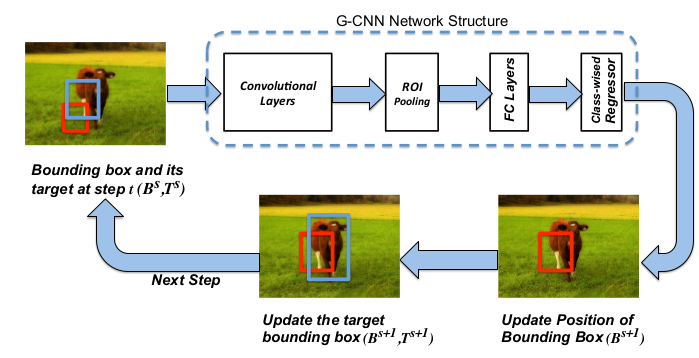
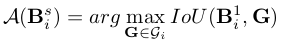
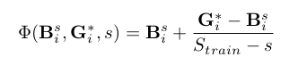
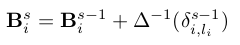
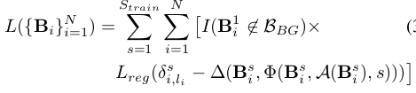
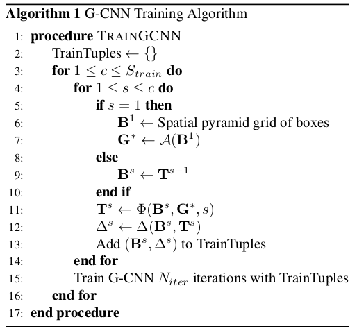
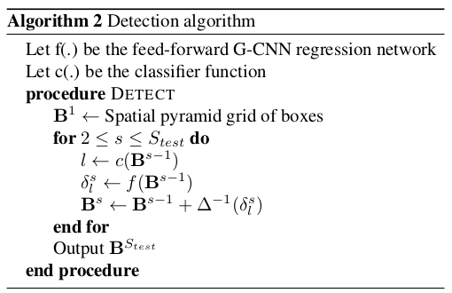

G-CNN: an Iterative Grid Based Object Detector
===

基本介绍
---

该文**使用递归的算法逐步的更新目标的位置**，而不再是基于区域推荐的模式。特征提取网络也是基于目前使用较为广泛的`VGG`等网络来提取特征。另外也是也是使用了`RoI Pooling`解决不同尺度和比例的图像。

基于区域推荐的算法，非常依赖推荐区域。如果推荐区域没有覆盖到目标，那么产生的结果将会变差。本文则不依赖于区域推荐，而是不断的进行更新，逐渐的逼近目标。

方法细节
---

本文提出的算法流程如下：

先是将图像划分成多个细小的网格，在训练的时候，每个网格都映射到标注的框上，重复迭代上面的步骤对每个网格进行更新位置，直到得到最终的边界框结果。在训练的过程中，则根据网络给出相应的置信度，根据训练得来的回归算法来更新位置。

对于流程而言，图像经过特征提取网络提取特征，这里使用`RoI Pooling`还是基于共享计算的需求。针对每个预测框，映射出该区域的特征，然后使用全连接网络获取特征向量，最终输入到回归网络中**针对每个分类**得出每个分类的位置的更新值。实际上，在训练的过程中位置的更新仅仅依赖于对应的分类，和其他分类无关。这里也会像`Fast RCNN`那样得到分类的置信度，因此在测试的步骤需要根据分类的置信度来确定使用那个分类的位置来更新当前的位置。

### 更新的设计

**从网格到标注框的映射**：在训练中，最重要的部分是要训练如何更新预测的框。一开始，需要将图像划分成多个网格，每个网格都认为是一个预测框。在训练的一开始，需要将网格映射到标注的框上。映射的公式如下：

这里一个标注框可能会包含很多个映射的预测框，训练的步骤主要强调的是更新的过程，因此多个位置向同一个方向进行更新的训练数据也是十分有必要的。

**目标框的生成**：由于算法是经过多步更新位置来确定最终的准确位置，因此训练如何一步一步更新是十分有必要的。文章提出了使用目标框的方式来确定每一步需要更新到什么程度，而不是一步即成。目标框的计算由以下公式确定：

上面的`G`代表对应的标注框。目标框实际上是和上一步中对应的标注框相关的，而不是随意生成的。

**更新步骤**：

在训练的过程中，位置的更新如下：

注意，位置的坐标也是向`Fast RCNN`那样是经过`log`的规范化的，这样处理能够使得得到的位置信息更为稳定。因此上面的更新操作需要进行反规范化。

**损失函数**：

算法的步骤
---

**训练**的步骤设计如下：

**测试**的步骤设计如下：

总结
---

该方法不再使用之前的那种基于推荐区域的算法，而是将图像先划分成多个网格，将网格作为预测框然后进行迭代的更新。在测试的过程中，只需要进行迭代`3`次就能够获得最终的结果。图像大概划分成`180`个网格，实际上测试的速度是明显的优于`Fast R-CNN`的。但是，对于重叠目标的图像来说，该算法可能不会有那么好的结果，毕竟每个初始的网格是要对应到该区域包含的目标上去，遮挡就很容易引进问题。
