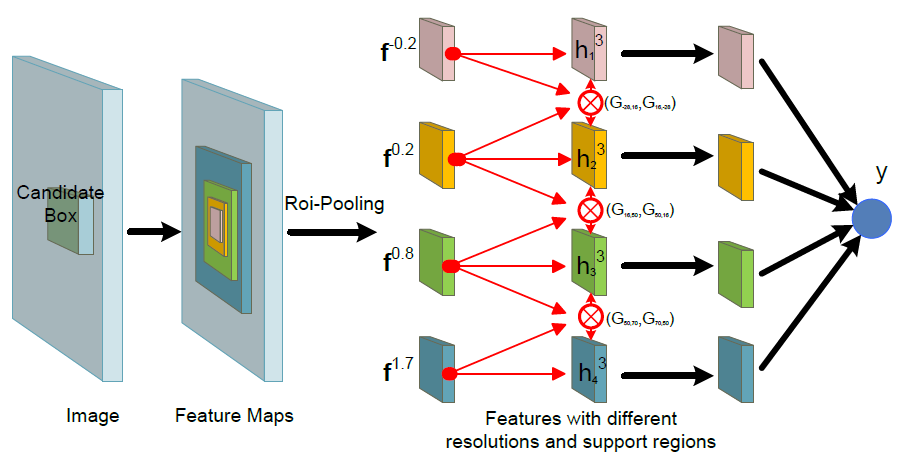
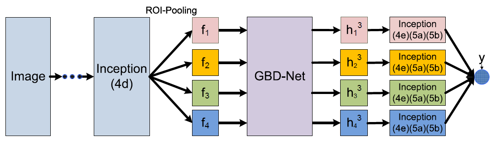
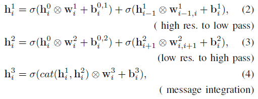
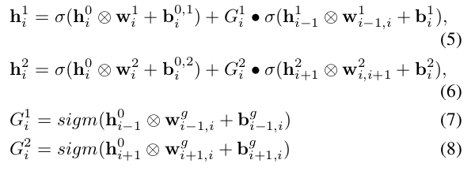
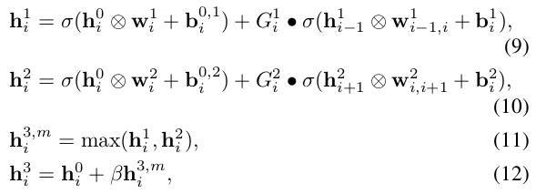
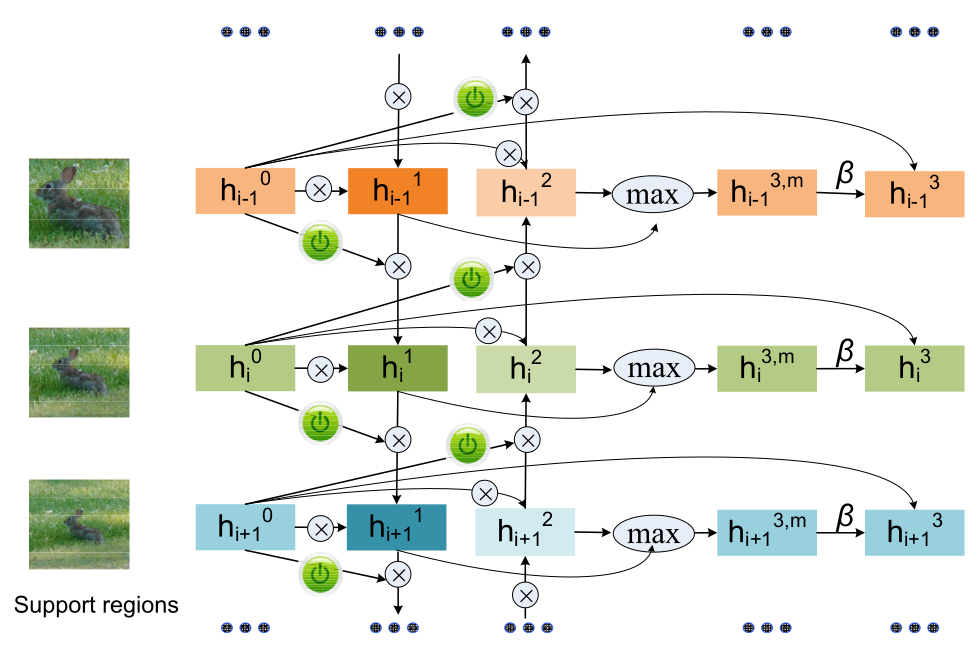

Crafting GBD-Net for Object Detection
===

基本介绍
---

本作者提出了**推荐区域**的两个问题：

- 推荐区域部分的视觉特征不足以进行分类，需要考虑目标周围环境才能够准确的确认分类。
- 目标的遮挡也会影响分类的准确性，从周围的环境进行推断也是一种方法。

为了解决上述问题，作者提出的方案如下：

- 从不同大小的区域获取获取特征图来增强分类的准确性。这里从不同的区域获取特征图不是之前那种从不同层提取特征，而是提出了`support region`的概念：以候选框的中心为选取特征的中心，然后依据候选框的大小直接取出不同大小的局部特征图；局部特征图的大小是不一致的，因此采用`RoI Pooling`对特征的大小进行归一化，最终进行融合。
- 虽然，环境的上下文信息能够提高分类的准确性，但并不是所有的上下文信息都是有效的，有的时候过度的引入上下文信息可能会覆盖掉检测的目标。因此，作者提出使用`Gate Function`来决定特征的传递。

本文的主要贡献如下：

- **Bi-direction Network**：局部的特征和周围的上下文特征是双向传递的，能过更好的对特征进行融合。为了能够确保特征大小的一致性，采用卷积操作进行合并。
- **Gate Function**：控制特征是否真的需要进行传递，过度的融合可能会降低准确性，因此必要时应该禁止传递。
- **Pipeline**：基于`Fast R-CNN`的目标检测方法，作者进行了修改，提出了新的检测步骤，能够在性能上进一步提升。

网络部分
---

### Fast RCNN 目标检测的步骤

传统的`Fast RCNN`目标检测的流程如下：

1. **生成候选框**：产生大量的候选框，便于后面进行检测。
1. **特征提取**：给定图像，提取出其特征。
1. **RoI Pooling**：每个候选框都被看做是一个感兴趣区域，该区域对应的特征图使用该池化操作归一成相同大小的特征图。
1. **分类**：池化后的特征经过几个卷积、池化以及全连接层，最终得到分类结果。

### 总体的网络结构

网络总体的流程如下：

使用整张图像作为输入，对于每个候选框，使用`RoI Pooling`操作来获取不同尺度大小以及不同支持区域的特征，然后使用双向网络对特征进行融合，最终使用分类算法得到最终的结果。

整体的方法基于`Fast R-CNN`，主要的修改如下：

- 在`RoI Pooling`的操作步骤中，对于同一个候选框，提取相同的中心位置，不同尺寸的特征图，然后使用池化操作将特征归一成相同尺寸大小的特征。使用这种方式融合多阶段的特征图。
- 不同尺度的特征图有选择性的使用几个卷积层来提取更高级的特征。
- 双向的结构用来在不同尺度的特征图间共享特征。
- 门函数用来控制特征的传递、融合。
- 最终得到的融合特征送到分类器进行分类。

**池化的操作**：该作者提出了一个新颖的融入上下文特征的方式，给定候选框，`Fast RCNN`会映射到特征图上进行特征的提取，但这样只能够提取局部区域的特征图。为了能够提取上下文信息，在对应的特征图上，提取不同大小的特征图，如上图`Feature Maps`所示。

使用`Inception`作为特征提取网络的网络结构如下所示:

### Bi-directional network structure

双向传递网络的计算公式如下：

- `i = [1, 2, 3, 4]`，代表不同尺度的特征图。
- 上图中，第一行将该特征和从较小支持区域但分辨损失小提取的特征进行融合，第二行将该特征和从较大支持区域但是分辨率损失较大提取的特征进行融合。第三行则是将两个特征进行融合，采用卷积的方式保证大小的唯一。
- 每个操作都加入`ReLU`的非线性变换。

### Gate functions

门函数用来控制独立候选框之间的特征传递，使用卷积的方式实现，卷积核的设计方式如下：

- 由于每个特征都有多个通道，对于每个通道使用不同的核函数。
- 特征的传递根据特定的视觉特征决定，特征由核函数使用卷积操作提取。
- 特征的传递率根据相邻区域的视觉特征决定。卷积核的大小跟特征提取的使用的卷积核大小不同。

针对上面的设计方式，门函数的设计如下：

上式中，`sigm = 1 / (1 + exp(-1))`，`G`代表门函数，用来控制特征的传递。

### Gated Bi-directional network structure

双向网络以及门函数相结合形成最终的网络，其函数表达如下：

最终的实现是上述两个部分的结合。图解过程如下：

### 损失函数的设计

损失函数同样采用两个部分，分类部分采用交叉熵损失函数，而位置采用平滑的`L1`损失函数。

总结
---

本文提出了使用门函数来控制不同的支持区域特征的融合，在一定的程度上增强了网络识别极为相似不同分类目标的能力。另外，使用了不同以往的特征融合方式，但是如果加入多层的特征，效果应该会更好，毕竟能够引入底层特征更为丰富的位置信息。
