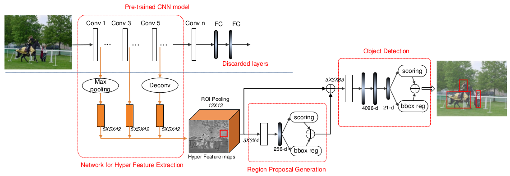
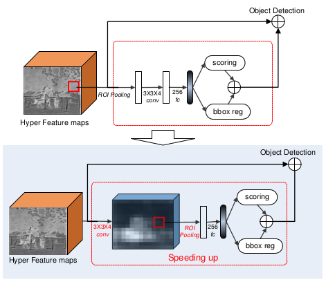

HyperNet: Towards Accurate Region Proposal Generation and Joint Object Detection
===

基本介绍
---

文中提出的算法基于*区域推荐*算法。其开创性的算法**R-CNN**之所以能够取得成功，主要时以下几个方面：

* 使用高层次的卷积神经网络提取的特征来代替手工提取的特征；
* 使用大量的推荐区域来减少对所有区域的遍历。

本文主要的工作集中于：

1. 如何能够使提取的特征信息更为丰富？在卷积的深层特征中，具有丰富的语义信息，但是由于过度的降采样，位置信息不明显；而在最开始的几层特征中，下采样的比例比较小，因此位置信息极为敏感，但是特征不是很明显。因此，为了能够更好的提取丰富的特征，将两者进行结合是非常有必要的。

1. 在区域推荐的算法中，推荐的区域产生是非常有必要的。RPN网络能够产生300个推荐区域，但是由于深层网络提取的位置信息比较粗略，定位的精确性比较差。而其他区域推荐算法可能在运行时间和性能上都比较差。本文则提出使用提取的特征进行推荐区域生成的特征，使用该方式，能够提高位置的精确度。

网络框架
---

**HyperNet**的基本结构如下图所示：

网络将整张图像作为输入，然后使用`VGG 16`作为特征提取网络（这里也能够使用其他的特征提取网络）。抽取第一、三、五个特征进行融合。为了能够使每个层的特征图大小一致，采用中间的特征图作为基本大小，然后第一层的特征图采用池化的操作进行下采样，而第五层的特征图采用反卷积的方式进行进行上采样。然后将特征图进行融合，得到`Hyper Feature maps`。将得到的特征图分为两个分支，一个分支用来产生推荐区域，而另一个分支则和推荐的区域共同作为输入进行目标的检测部分。

### Hyper Feature 的产生

根据`Fast R-CNN`的算法，对图像需要进行预处理。将图像进行缩放，保持原来的宽高比且保证最短的边为`600`。从上面的图可以看出，产生的`Hyper Feature`使多个层次的特征图融合到一起的，那么需要对其进行局部的操作来平衡不同层次特征图数值大小（由于不同的层的数值可能会不同，毕竟经历了不同个数的卷积层，因此在融合的时候，需要考虑这个问题）。文章使用了`LRN`的处理方式。

### 推荐区域的产生

对于每张图像，网络大概生成`30k`的候选区域。正如上图的`Region Proposal Generation`所示，图像提取出的特征图，使用`RoI Pooling`的操作产生`13x13`的特征图。经过池化的特征图，经过`3x3x4`的卷积操作之后，使用全连接的方式产生`256-d`的特征向量，最终分为两个部分，一个部分给出该区域是否存在目标的`scoring`，另一部分则使用`bbox reg`生成位置上的便移。在产生了候选框之后，需要使用`NMS`对框进行去重，重叠区域的阈值设置到`0.7`。最终选出概率最高的`200`个区域推荐。

实际上使用这种方式先产生区域推荐的确能够提高一定的准确率，但是操作过于复杂，需要耗费较长的时间。

### 目标识别

目标识别采用了较为广泛使用的`FC-Dropout-FC-Dropout`流程，并做了以下的修改：

* 在全连接层的前面，加入了`3x3x63`的卷积层来提升分类的准确性。另外，这个操作也降低了特征的维度。
* 将`dropout`层的比例从`0.5`调整到`0.25`。
* 目标检测的输出和推荐区域的产生一致，也是分为两个分支，不同的是：一个分支产生每个分类的概率，另一个分支产生对位置上的精确调整。

同样的，需要对这些产生的区域进行`NMS`的去重。

### 其他的问题

首先，在位置的定义上，也是使用了同`R-CNN`的形式。这部分将会在*RCNN*系列着重介绍。

其次，上面在推荐区域产生的操作中，可以进行加速，可以先对特征进行卷积操作，然后在进行`RoI Pooling`的操作，这样能够节省每一个`RoI`区域都要单独进行卷积操作的时间消耗。两种方式的对比图如下：

总结
---

其他关于详细数据的部分不再赘述。最后再看全文，实际上仅仅是修改了区域推荐的部分用来替代`RPN`网络。使用了卷积的方式预先的产生类别无关的推荐区域，然后进行筛选。这样能够大大提高推荐区域的置信度。但是另一个方面，这一步操作是比较冗余的，这一步只是提前对推荐的区域进行进一步的筛选工作，引入了比较耗时的操作。
