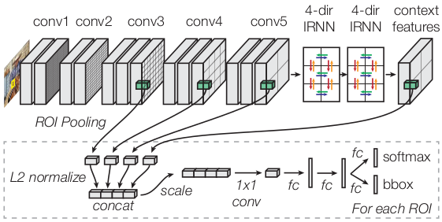
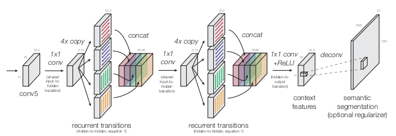
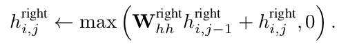
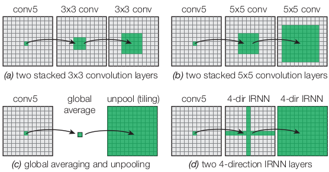

Inside-Outside Net: Detecting Objects in Context with Skip Pooling and Recurrent Neural Networks
===

基本介绍
---

该文章考虑了图像的上下文信息(contextual information)，以及细粒度的图像特征。在感兴趣区域的内部，在不同的池化层提取特征，能够获得较为细粒度的特征信息。在感兴趣区域的外侧，则使用循环神经网络(RNN)，获得感兴趣区域的上下文信息。

网络的结构如下图所示：

网络还是基于区域推荐的算法，使用空间金字塔池化的方式(RoI Pooling)将不同尺度的感兴趣区域特征处理成大小一致的特征图。特征提取的网络还是使用了`VGG 16`的框架，为了能够使得训练的权重和之前训练的数据保持一致，作者提取使用`L2范数约束`对提取的特征进行约束，防止合并到一起出现结果过大的现象。然后合并到一起，经过尺度的变化后，将提取 的4个部分的特征相互融合。然后使用全连接层得到最终的分类结果和边框信息。另外，在`VGG`网络的最终输出层，接入了`RNN`网络来提取上下文信息。

结构设计
---

正如上面所讲的，本文是考虑两个方面的特征：感兴趣区域内的细粒度特征以及感兴趣区域外的上下文信息。下面针对一些特定层进行讲解：

### 从多个层进行池化

由于`VGG 16`能够得到非常好的分类结果，作者希望能够保留`VGG 16`原有的空间数据的维度和大小。因此，如果对多个层进行池化，那么最终的输出尺度大小以及结果的大小都将会受到影响。文中提出以下解决方案：

1. 为了能够保持原有全连接层接受的输入大小，提出先将池化的特征将每个通道连接起来，然后使用`1x1的卷积层`进行降维。
1. 为了能够保持特征原有数据那样的数值范围，提出使用`L2 范数约束`对每个池化的特征图进行约束，然后再调整其范围。
  在使用`L2 范数约束`的时候，有如下几种选择：
    * 按照通道的维度进行求和，然后在每个空间位置上使用范数约束。
    * 对每个感兴趣区域的特征整体进行求和，然后将其作为单一的整体进行范数约束。
  使用范数约束后，还需要调整数值的大小。文中提出，使用**固定的比例**调整的效果是比较好的。文中是使用`Fast R-CNN`来估计这个比例的，当使用在整个特征图上进行求和时，该值的大小大约为`1000`，当针对通道对每个位置进行求和时，该值的大小大概为`130`。

### 上下文特征

本文的一个重点就是引入了上下文的特征，详细的计算框架如下图所示：

该部分网络使用`VGG16`最后一层的特征图，先使用`1x1`的卷积层共享每个通道的特征，然后分为4个分支，对应4个基本的方向，对每个方向使用循环神经网络进行上下文特征的提取。最终提取的上下文特征和输入的特征具有相同的尺寸。

循环神经网络的实现有如下几种：
1. gated recurrent units (GRU, 门控循环单元)
1. long short-term memory (LSTM, 长短期记忆)
1. plain tanh recurrent neural networks.
1. IRNN (使用`ReLU`作为非线性单元)

文章采用`IRNN`的方式，在性能和计算的效率上都有一定的优势。
计算方式如下：

文中提出权重矩阵可直接使用单位矩阵，那么上面的公式就类似于加入了`ReLU`的累加计算。另外，如上面的结构图所示，在后面加入了`16x`的反卷积层，这样就能够得到类似于分割的`mask`信息，使用这种信息加入损失函数也能够提高识别的准确度。

实现细节
---

文中的代码是基于`Fast RCNN`修改的，同样使用`VGG 16`作为基础的特征提取网络。在训练的时候，使用4张图像作为一个批量，每张图像随机的取样128个感兴趣区域，一个批量也就有512个感兴趣区域。参数的梯度的`L2 范数`的值大于`20`（当使用4张图像作为批量的时候，该值为`80`）的时候，需要重新进行调整。

### 训练步骤

在训练的时候，分为两个步骤：
1. 前`40k`(coco该值为`80k`)个迭代：`conv1_1 ~ conv_5_3`不参与参数的更新。学习率从`5e-3 ~ 1e-4`递减。
1. 后面的`100k`(coco该值为`320k`)个迭代：`conv1_1 ~ conv2_2`不参与参数的更新。学习率从`1e-3 ~ 1e-5`递减。

### 一些设计的验证

1. 从多个层进行池化的验证：文中的图表给出，从`C3, C4, C5`三个层提取特征进行池化能够得到较好的效果。另外，使用`L2范数约束`并重新调整大小能够有效的提高准确率。
1. 使用最终语义分割的损失函数，能够提升性能。毕竟使得网络针对每个位置都有了监督，能够大大提高结果的鲁棒性。
1. `L2范数约束`使用固定的数值，并在整个特征图上进行处理能够得到最优的结果，但是结果的相差并不是很大。
1. 提取上下文特征的方式：
    * 2x 512x3x3 Conv
    * 2x 256x5x5 Conv
    * Global Average Pooling
    * 2x 4-dir IRNN
  针对上述的4中方式，其接受域如下：

    
  从上图可以看出，使用卷积的方式获得的上下文信息是非常有限的，而使用全局平均的池化方式，获得特征又不够明显，而使用`IRNN`的方式获得特征能够针对其所在的行列以及整张图像中获得较强的上下文特征。

总结
---

该文，引入了上下文的特征信息并提出使用**循环神经网络**的方式来提取上下文的特征。另外，使用了不同层次的池化特征，对这些特征的融合极大的丰富了感兴趣区域内部的特征。**将感兴趣区域的内部特征和外部特征进行结合**，是这篇论文最大的创新点。最后，文章还提出使用分割的信息，将其加入到损失函数中，也在一定的程度上提高了识别的准确率。
