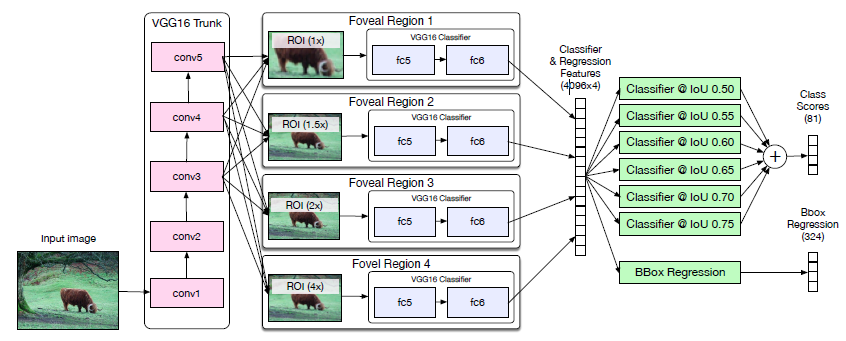

A MultiPath Network for Object Detection
===

介绍
---

该论文基于`Fast RCNN`，提出了以下三个方面的改进：

1. **Skip Connection**：融合多个阶段的特征图，增强多种尺度下目标识别的鲁棒性；
1. **Foveal Structure**：通过融合多个图像上下文来提高位置的准确性；
1. **Integral Loss**：修改了原有的损失函数，使位置更为精确。

方法
---

整体的框架图如下：

基于`Fast R-CNN`，使用`VGG-D`的网络提取特征图，对于每个推荐区域对应的特征，同样使用`RoI-Pooling`得到固定大小的特征图。使用这些特征，输入到分类器得到每个分类的置信度，与此同时，使用回归网络得到更为精确的位置。

### Foveal Structure

传统的`Fast R-CNN`并没有使用推荐区域周围的上下文信息。文中提出了使用不同尺度的推荐区域来引入更多的上下文信息。正如上面的图所示，分为4个通道，相较于原有的推荐区域，中心以原有的推荐区域为中心，而大小分别为`1x, 1.5x, 2x, 4x`的推荐区域，最终将得到的特征向量进行融合，共同参与结果的决策。

由于使用了不同大小的推荐区域，因此，需要使用`RoI-Pooling`生成大小一致的特征图。后续链接两个全连接层，得到特征向量，将4组特征向量组合成一个特别长的特征向量。该向量同时被最终的分类网络以及回归网络使用。

### Skip Connections

传统的`Fast R-CNN`在第五层之后使用池化操作。基本上特征图相对于输入图像下采样了16倍。然后，数据集的大部分目标所占的空间是比较小的，这么大的下采样，最终得到的特征图将会很小，需要经过`RoI-Pooling`的操作进行上采样才能得到相同大小的特征图。过度的下采样将会降低位置的精确性。因此，采用了多个阶段的特征图进行融合，来获取每个特征区域的总的特征。

由于不同阶段的特征图的大小是不一致的，因此，需要先使用`RoI-Pooling`进行下采样，这样便能够得到相同尺寸的特征图。将三个池化的特征图合并起来，然后使用`1x1`的卷积操作进行参数的共享，得到最终的特征图。使用降采样程度低的特征图能够有效的增加位置的精确度。

### Integral Loss

传统的`Fast R-CNN`使用上图中的第一个公式作为损失函数。损失函数分为分类和位置两个部分：分类采用普通的**交叉熵损失函数**；位置一般都是用**L2**损失函数。对于上面的公式，需要将每个推荐区域共享的损失函数合并求和。对于每个推荐区域，当预测的结果和标定的结果的`IoU`大于一定的阈值（通常使用`0.5`），就认为这个分类是可信的。但是对于上面的第一个公式而言，也就是说，对于大于阈值的的推荐框，所得到的损失并没有什么区别。因此作者考虑了`IoU`的影响，提出了第二个公式。公式采用6个不同的阈值，分别为`{50, 55, 60, 65, 70, 75}`，将最终的损失进行求平均来得到最终的损失函数。

训练方式
---

文中使用`COCO`数据集作为训练集，一些参数如下：

* Batch Size: 4
* Object Proposal: 64
* Iteractions: 200k
* Learning Rate: 1e-3 and 1e-4 (after 160k iterations)

总结
---

本文，也是考虑了目标所在推荐区域的上下文信息，采用了和`ION`不同的方式，这里是使用了**不同倍数大小的推荐区域**，将最终的结果进行融合来增加上下文信息的。另外，同样也是使用了不同阶段的特征图来提高位置的精确度，采用和`ION`网络相同的不同阶段特征融合方式进行处理。以及，最终提出了一个新的损失函数将预测的位置的`IoU`考虑进去来进一步提升位置的精确度。
