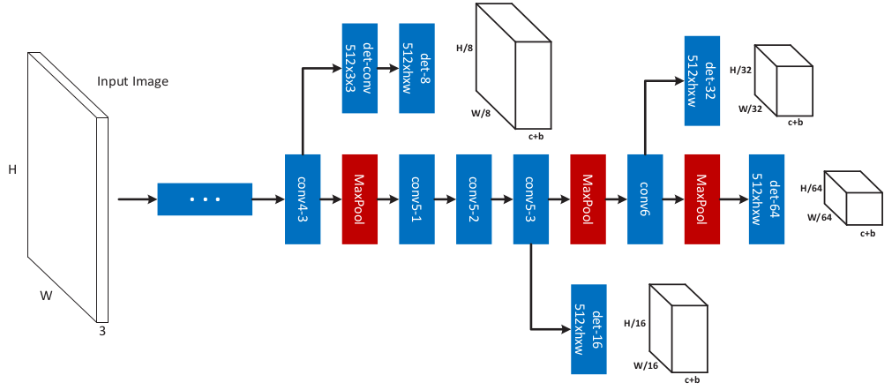
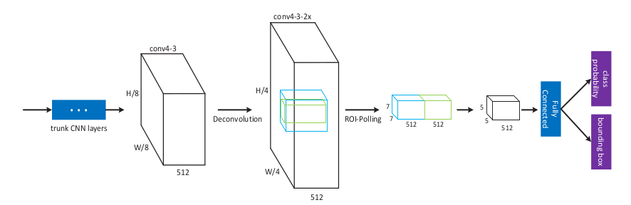

A Unified Multi-scale Deep Convolutional Neural Network for Fast Object Detection
===

基本介绍
---

在`Faster R-CNN`中，虽然能够高效的使用`RPN`产生一系列的候选框，但是在特征图上使用滑窗的方式产生的，虽然能够产生多个尺度的特征图，但是每次都移动一定的距离，而且感受野也是固定的。如果使用固定的感受野，并且每次都是跳过一定的距离产生候选框，那么最终生成的候选区域是无法覆盖到所有的区域的。因此，作者提出了`MS-CNN`算法，该网络包含两个子网络：**目标生成网络 (object proposal network)**以及**精确检测网络 (accurate detection network)**。另外，作者提出，将特征图进行上采样，而不是将图像进行上采样，使用反卷积层将特征图尺寸扩大，使得小目标在特征图上也有足够大的尺寸。

框架
---

### 多尺度检测

在目标检测领域，能够覆盖所有尺度的目标是一个极其困难。作者提到了两个方法：

1. 将输入进行*扩缩放*，使之能够检测出所有可能的尺度。这种方法无法进行共享计算，需要耗费大量的计算资源，因此是不推荐的。
1. 使用多个检测网络进行检测。不需要多次计算特征图，只需要计算一次就够了，能够节省大量的计算时间。但是，不同尺度的特征图如果进行结合，多个分类器之间的结合是比较困难的。

该作者提出的算法就是基于第二个算法的。使用多个阶段的特征图，并且在每个阶段，用反卷积神经网络对原有的特征图进行放大，这样不仅能够获得不同尺度的特征图，而且对于不同的特征图，其感受野也是不同的。使用该方法能够模拟大部分目标的尺寸。

### 结构

详细的网络结构如下图所示：

网络使用多个不同的检测分支，这些分支从不同的卷积层获取特征图，然后使用检测网络得到不同的检测结果。

### 实现细节

1. **数据增强**：由于网络使用了多尺度的检测，因此数据增强部分不要要在尺度上进行数据的增强。但是，在多目标的检测中，由于目标尺度的不同，大尺度目标数量可能会比较少，为了缓解这种不平衡，需要将原有的图像进行随机的扩缩放。

1. **微调**：在训练的时候，使用`VGG`网络对权重进行初始化，由于引入了多个阶段的损失，在训练的一开始会不稳定，因此训练分为两个阶段进行：第一阶段使用随机的采样方式，使用`0.00005`的学习率训练10000个迭代；第二个阶段使用`bootstrapping`的采样方式，使用`0.00005`的学习开始训练，每`10000`个迭代将学习率下降到之前的`1/10`，总计训练25000个迭代。

### 目标检测网络

目标检测网络的设计如下图所示：

首先，还是使用`RoI Pooling`对抽取特征，然后输入到全连接层和输出层。反卷积层的作用是将特征图的维度扩充到原来的2倍，以便能够更充分的产生多个尺度。

本文作者还提出了使用上下文信息，如上图所示，在特征图进行`RoI Pooling`的操作时，绿色的部分代表映射的特征图，为了能够引入上下文信息，将范围扩大了`1.5`倍，即蓝色框，以此提取出来的特征进行融合，将上下文的特征融入进来。

总结
---

本文主要的贡献在于从不同的层抽取特征，而且**将特征进行反卷积的操作来增加更多的尺度**。另外，在进行目标检测的时候，不仅将目标对应的区域进行池化抽取特征，而且还扩大`1.5`倍来提取上下文信息来增强目标检测的能力。在整体的流程上，则是采用了`Faster R-CNN`的流程，只是引入了多尺度的检测。
