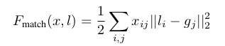
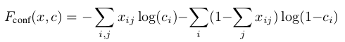
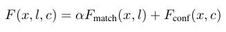
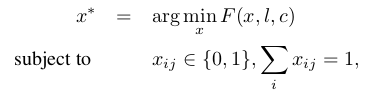
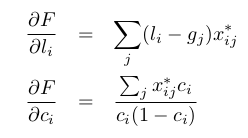

Scalable Object Detection using Deep Neural Networks
===

基本介绍
---

**目标检测**：之前的方法是在图像检测任务中，基本上都是采用**对图像所有位置，所有的尺度**进行遍历。这也就说明将会占用很大的计算资源，速度上也很慢。文章提出使用了类无关的深层神经网络进行框的预测。主要的贡献如下：

* 将目标识别的**位置识别**看作是回归问题。在给出每个框的同时，给出该框可能包含目标的概率。
* 将预测**框**作为训练的一个部分，提出了使用`L2`损失函数作为边界框的损失。
* 将**框**的预测看作是**类无关**的预测，能够可扩展的产生*预测框*，而且由于是和类不相关的，十分灵活。

提出的方法
---

**目标**：预测*一系列的可能存在目标分类的框*来达到*类无关的可扩展*目标检测。使用深度卷积神经网络，给出固定数量的预测框。另外，对每个框都给出存在目标分类的概率。

**模型**：为了实现上面的目标，将第`i`个预测框和它对应的置信度相结合，共同从最后一层网络中得出：
* **预测框**：将左上角和右下角的点作为标示预测框的点，这些点经过图像的尺寸进行标准化，来达到尺寸不变性的目的。每个点都经过最后一层隐藏层的标准化得到。
* **置信度**：置信度表示框中包含目标分类的概率大小，该值由最后一层线性变换的隐藏层经过`sigmoid`得来。

上述两个值都连接到最后一个隐藏层。在预测的时候，算法产生固定数量的预测框，经验值为`K=100`或`K=200`，一般上，得到的预测框是冗余的，需要使用**置信度**进行`NMS`处理。对于分类来说，使用另外的深度卷积神经网络得来。

**训练**：假设训练的图像中标注了`M`个目标，但是深度神经网络得到的结果是固定数量的`K`个，远大于实际上的数量。事实上，我们更关注概率*置信度*较高的预测结果。也就意味着我们需要通过将和**实际标注结果匹配的预测框**的置信度最大化。同时，对于不匹配的预测框，需要将它们的置信度最小化。

使用`x_ij`表示第`i`个预测的框是否和第`j`个标注的框相同，那么匹配的程度通过下面的公式确定：

使用`L2`损失函数来进行量化。另外，对于置信度的量化如下：

当第`i`个预测框和第`j`个标注框匹配的时候，上式的结果为`-log(c)`，上述的值最小化以增加置信度。反之，值就趋向于最大化来降低置信度。
整体的损失函数设计如下：

**最优化**：最优化的过程可以描述如下：

上面的约束，要求损失函数最小化，一方面能够增强匹配框的置信度降低无用框的置信度。另一方面也能够大大精确匹配框的位置。具体的求导结果如下：

**实验细节**：

- 对标注的结果进行**聚类**，然后在预测的结果找到`K`个中心与之相近的预测框。之后，算法都基于之前的预测结果做残差。
- 在匹配的步骤中使用这些先验：不再使用`N`个标注结果去匹配`K`个预测结果，而是使用这`K`个先验和标注结果进行匹配。一旦匹配了，置信度就像之前一样计算。另外，位置预测的损失不会再改变了（实际上先验的位置并不是真实的位置，先验的位置后面还会跟一个线性层来确定更为精确的位置）。使用这种先验的方式能够大大的增加速度。

总结
---

该论文主要的贡献在于给出了**目标识别中关于位置的预测：使用回归算法进行位置的预测**。提出了使用**L2损失函数**来确定位置。每个位置上都有该位置**包含目标的置信度**。但是文章并没提出新的算法，仅仅是为目标的识别提供了一个损失函数，但后面很多的论文都是基于这种思想提出的。
