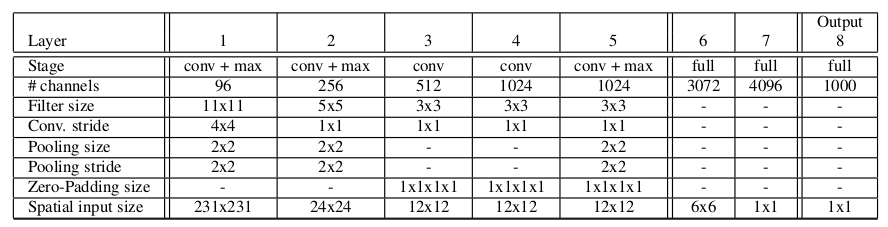
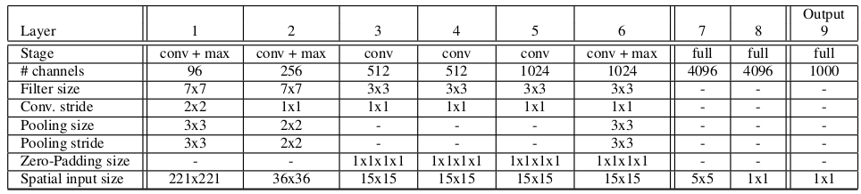
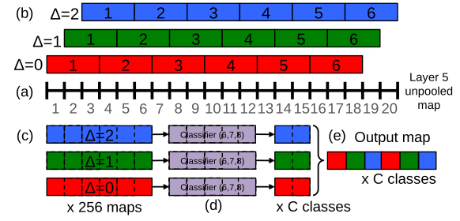
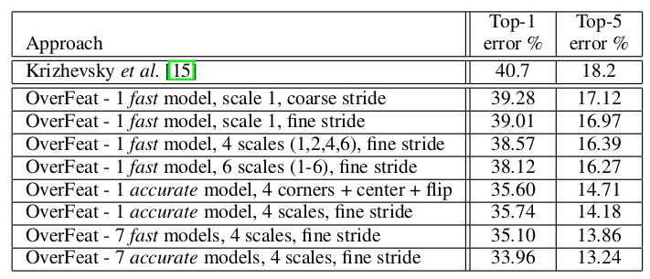
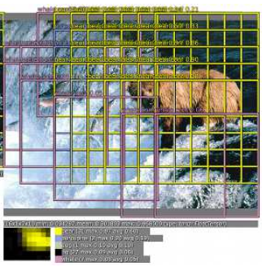

OverFeat: Integrated Recognition, Localization and Detection using Convolutional Networks
===

基本介绍
---

作者首先将视觉任务分为三个阶段：**分类**、**定位**以及**检测**。

- 分类：给出图片包含目标的类别；
- 定位：是分类和检测的中间一个步骤，主要是为了能够方便来评价定位算法的性能；
- 检测：就是找出位置并给出该位置目标的类别。

> 引入了定位的操作，是为了能够独立的去评价定位的准确性，而不需要依赖于最后的检测步骤。

分类
---

分类算法和**AlexNet**特别类似。在`ImageNet 2012`训练集上进行训练(120万张照片，1000个分类)。和**AlexNet**一样在训练的时候使用固定尺寸的输入，但是在分类的时候使用多尺度的输入。每张图片进行下采样，满足最小的边为256个像素。然后随机的裁剪大小得到221x221像素大小的图像，使用128张图像作为一个批量。网络的权重随机初始化，均值为`0`，方差为`0.01`。使用梯度下降的方式更新权重，学习率初始设置为`0.05`，在30、50、60、70、80的时候降低到一半。

网络的架构如下图所示：
快速版：

精确版本：

前面的5层和**AlexNet**基本一致，使用`relu`作为非线性的激活函数并使用`pooling`作为下采样的方法。区别如下：

- 没有使用归一化操作；
- 池化的区域是没有重叠的；
- 在第一个和第二个卷积层都有较大的特征图，这是由于使用了较小的步长。虽然大的步长能够加速，但是也影响到了准确率。

### 多尺度分类

多个视角共同的给出最终的结果能够显著的提升最终的结果：使用10个不同视角的图像（4个角和中心位置，以及在水平方向上的翻转）。但是这种方法还是会忽略到图像的大部分位置，而且当这些视角重叠的时候，还浪费计算资源。另外，固定的视角使用的是固定尺度大小的图像，并不能使用多尺度的图像来增强网络模型的鲁棒性。
因此，该作者提出了滑窗的方法。并不是在原始的图像上进行滑窗的方式，而是在得到的特征图上进行滑动，这样能够大大的节省计算资源。另外，整个网络相当于对图像进行了36倍的下采样。如果简单的进行计算，那么相当于在原始的图像上每36个像素产生一个分类的向量。这种粗略的输出分布将会因为窗口和目标没有对其而降低性能。**为了解决这个问题，在得到最后的特征图上，对下采样的操作进行逐点便移，那么就相当于下采样了12倍**。整体便移的过程如下图所示：

流程：

- 对于一张图像，在没有池化的第`5`个特征图上进行操作。
- 在上述的特征图上进行3x3的最大池化操作，没有重叠区域。每条边上都要便移0、1或2。
- 最终将会得到9个不同池化了的特征图。
- 分类层（6, 7, 8）输入为`5x5`，在池化的特征图的每个位置上产生一个`C`维的输出向量。分类操作使用滑窗的方式在特征图上滑动，最终生成C维度的特征图。
- 输出的特征图重构成三维的输出特征图（两个空间维度以及分类维度）

> 优势：当图像的输入大于固定的输入时，可采用这种方式。在整张图像上进行卷积操作，最终得到的特征图将会大于期望的特征图，使用滑窗的方式能够产生固定大小的输出卷积图。由于前面的卷积计算不再重复，能够大大的节省计算资源。

上述的操作在水平翻转的图像上也要进行重复的工作。最终根据以下方式确定最终的分类：
1. 在每个尺和翻转，取每个分类在空间上的最大值；
1. 将从不同尺度和翻转的`C`维向量进行平均；
1. 从平均的分类向量中取出最大的结果。

### 结果

> Fine Stride = {0, 1, 2}; Coarse Stride = 0

定位
---

这里，像大多数的基于推荐区域的算法一样，得到的特征图将会分为两个分支：一个分支作分类计算，另一个分支进行回归计算得到位置信息。这里，为了节省时间，由于前面能够得到所有尺度以及所有位置的特征图，最终能够达到同时计算的要求。
**回归的网络**将池化的特征图作为输入，经过两个**全连接**层（分别用4096个通道和1024个通道）。最终的输出为表示边界框的4个位置信息。*由于前面在特征图上使用了便移操作进行池化，那么在最终的结果上，也要考虑便移的影响*，如下图：

### 结果的合并

- 令`C`作为在`{1, 2, 3, 4, 5, 6}`上`top k`个分类，从每个尺度上选出检测分类结果概率最大的那个；
- 令`B`作为根据每个`C`中分类在所有位置和尺度上预测出来的边界框；
- 得到`B`的并集
- 进行合并工作，直到每两个结果的重叠小于一定的阈值（作者这里使用了一个函数来评价两个边界框的相同程度）。
  > 函数： 两个框中心位置的距离以及它们重叠区域面积的和。进行合并的时候，是将两个位置坐标进行求平均。

检测
---

**检测的训练**和分类是类似的，但是一张图像上所有的位置是同时进行训练的。和**定位**任务的不同是，**需要检测出没有目标分类存在的情况**。为了能够更好的检测出来背景，在训练的时候就应该引入背景。但是背景占据较多比例会导致分类的不准确。作者**通过随机或者选取最可能分不准确的反例**作为背景的训练数据。由于分类和定位的任务能够独立在检测任务之前进行训练，因此检测的任务只需要进行 **Fine Tuning** 即可。

总结
---

本文的主要贡献在于**提出了在特征图上进行滑窗**进行池化的操作，能够大大的减少计算量。但是对于**多尺度**的计算，还是需要在训练之前进行控制。而对于**不同的位置**是在特征图上进行平移得来，这并不能代表在原始图像上的所有位置，因此该方式产生的位置还是比较粗略的。
