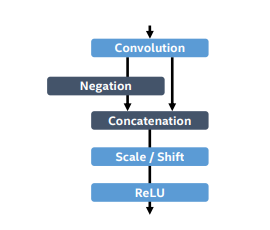
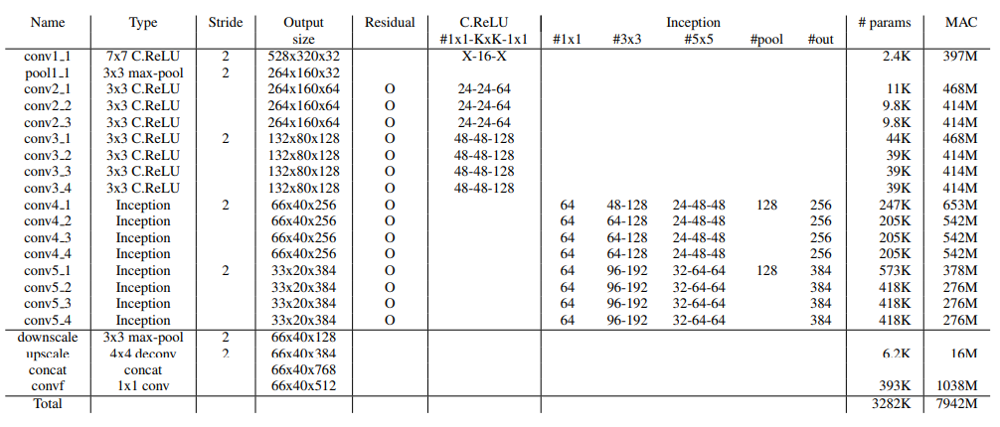

PVANET: Deep but Lightweight Neural Networks for Real-time Object Detection
===

该论文主要是修改特征提取的网络。如果使用原始的`Inception`网络作为特征提取的网络计算速度将会很慢，本文就是将`Inception`网络融入到特征提取的网络中。

网络结构
---

### C.ReLU

该部分的动机来自于对卷积神经网络激活的一些观察，从观察中可以看出，`C.ReLU`能够将通道数量减少一半，但是精度的损失却可以忽略。下图显示了该部分的设计：

在上图的网络结构中，加入了`scale`和`shift`的操作，能够使得每个*通道的斜率和激活的阈值*各不相同。

### Inception

在目标检测的任务中，更多的开始使用`inception`网络作为特征提取网络，但是其效率很低。作者对此进行了修改：

上图左侧部分显示了`Inception Block`部分，上图的右侧部分显示了下采样的方案。

### HyperNet

多尺度的特征在目标检测方面是十分有用的，将细粒度的特征和高度抽象的特征信息进行融合，能够极大的提高特征的表示能力。作者也提出了该方面的解决反感，采用了三个不同尺度的特征进行融合。具体的实现参见整体的框架图。

### 整体的设计

网络的整体设计如下图所示：

具体的设计表如下：

总结
---

该论文仅仅是对特征提取网络进行了修改，使得该网络能够融合更多的特征信息，而且在计算效率上进行了很大的提升。
