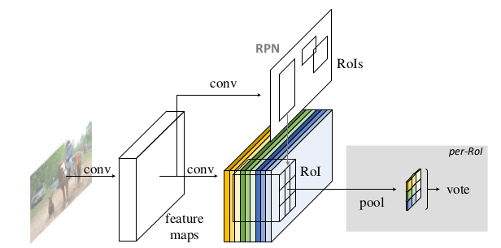

R-FCN: Object Detection via Region-based Fully Convolutional Networks
===

基本介绍
---

作者提出了`RFCN`网络，该网络具有共享的全卷积操作。为了将`翻译不变性 (translation variance)`引入到网络中，使用特殊的卷积层来产生一系列上**位置敏感**的特征图。这些特征图将位置信息编码成相对的空间位置。之后，使用`RoI Pooling`操作将这些信息抽取出来。

实际上，该网络是对`Faster R-CNN`进行了修改，引入了相对空间位置。

网络结构
---

基本的网络结构如上图所示，该网络同样采用两个阶段：区域推荐生成以及分类。给丁推荐区域，该网络对每个区域分类成目标或背景。在上图中，提取的特征图经过卷积操作得到一个`位置敏感特征图 (position-sensitive score maps)`，该特征图的通道数为`k * k * (C + 1)`，文中使用`k = 3`，用来表示*左上、中上、右上、、、右下*这`9`个位置。然后，使用*位置敏感的感兴趣区域池化操作*，产生了池化之后的特征图，该池化的结构包含了该区域的特征信息，以及该区域周围的特征。

该网络在特征提取部分使用了`ResNet`，但是其他部分与`Faster R-CNN`保持一致，仅仅是引入了`9`个位置敏感的特征，所有的位置敏感的特征共同参与最终的决策。当`k = 1`时，总体的框架完全和`Faster R-CNN`相同。
