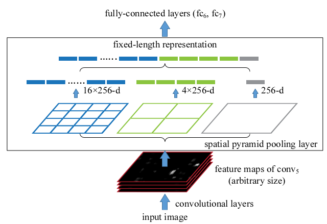

Spatial Pyramid Pooling in Deep Convolutional Networks for Visual Recognition
===

基本介绍
---

该文章主要是提出了`Spatial Pyramid Pooling`层，来解决图像在**比例**和**尺度**上不一致的问题。由于之前所有的算法都是要求输入的图像大小是固定的，在进行训练或测试之前需要将图像进行裁剪或者缩放。而裁剪的一个问题是，裁剪可能会导致图像中的目标被裁剪，图像无法包含整个目标。而缩放带来最显著的问题是目标的比例被改变了。这两种方式都可能导致精确度的损失。

**在深度学习框架中，为什么会要求输入图像的尺寸一致呢**？主要是因为在深度学习框架中，最后都需要**全连接层**来产生固定尺寸的置信度，其输入也是固定的，在之前的深度学习网络中，只有图像的输入是固定大小的，才能够产生固定大小的输出。

本文提出的`SPP`层，应用于最后一个卷积层，能够将任意尺寸的特征图池化成固定大小的输出。这样就能保证不同的输入图像总是能够产生固定的输出。另外，在一定意义上，`SPP`层相当于将图像从细粒度划分成多个粗粒度等级的图像，最终将不同粒度的特征融合起来，因此这种方式能够有力的防止特征的丢失。

**SPP的特性**：
- 无论输入的尺寸大小是多少，总能够产生固定大小的输出；
- 使用多个尺度的池化大小，能够具有丰富的语义信息；
- 能够同时池化特征提取网络不同输出层的特征，更加方便的进行不同层次的特征融合。

**训练过程**：训练的过程中也能够使用不同大小的图像作为输入，这样又能够增加图像的尺度多样性，能够有效的防止过拟合。在训练的时候，对于一个接受不同大小输入的网络来讲，可以近似的看成共享参数的多个接受固定大小输入的网络。因此在训练的时候，每个轮回使用相同的输入大小，而不同的轮回使用不同的输入大小，这样扩展了输入图像尺度的多样性。作者提出实验验证这种训练的方式即高效又提高了测试的准确度。

SPP在深度网络中的应用
---

### 卷积层和特征图

论文基于流行的`7层网络`架构的深度学习算法，前5层是卷积层，用来提取图像的特征，后面的两层是全连接层，用来给出最终的输出。上面介绍说之所以上述的网络需要固定的图像作为输入是因为全连接层的存在。也就是说，前面的卷积层能够接受不同尺度的输入，只不过产生的特征图不一致而已，实际上卷积操作之后的特征图相当于是对原来图像的缩放。产生的特征图和之前传统算法使用的一些特征是相类似的。

### SSP层

SPP是通过方格划定池化的范围。方格的大小和图像的大小成比例，而方格的数量和图像的大小是无关的。这跟之前出现的滑动窗口的方法是不一样的，滑动窗口的方法窗口的数量和图像大小是相关的，而窗口的大小是一致的。为了能够使其他的网络能够接受不同的输入大小，**将上述7层网络中，连接卷积层和全连接层的池化成换成SSP层**，如下图：

如上图所示，在每个空间的方格中，使用最大值池化的方式（也可以使用其他的方式）。通过上图明显可以看出当使用固定数量的方格进行池化的时候，输出总是固定的，因此得到的特征向量也是固定长度的。因此利用这种方式，输入图像的大小就可以是任意的，输入图像的宽高比例也可以是任意的。当输入图像的尺度是不同的，特征提取网络输出的特征图也是不同的，**SIFT**向量对尺度信息来讲是十分敏感的。因此，在深度学习中，尺度的信息也是比较重要的。另外一点，在**SPP**层中，最为粗粒度的池化操作是针对于整个图像进行的。在很多论文中都指出**全局的池化操作能够提升网络的鲁棒性，也能够在一定程度上防止过拟合现象的发生**。

### 训练技巧

在训练的时候，每个`batch`都采用固定大小的图像作为输入。图像固定输入就是失去了SPP网络的价值，但是如何模拟不同大小图像作为输入呢？有两个方向需要注意：一是需要保持目标原有的比例关系；而是能够尽可能的使用不同尺寸目标的图像作为输入。

- 对于第一点而言，作者使用随机裁剪的方式，便能够保证目标的宽高比是不变的。
- 对于第二点而言，作者则是在不同输入图像的阶段，小尺寸的图像是大尺寸图像经过`resize`得到，而不再次经过裁剪。这样能够产生众多不容尺寸的目标。

另外，不同尺寸的输入切换对于神经网络的训练而言是十分耗时，于是作者提出在每个`epoch`使用相同尺寸的图像作为输入，下一个`epoch`采用另一种尺寸作为输入尺寸。

SPP在分类算法中的应用
---

**训练方式**：在`ImageNet`数据集上，先将图像进行缩放，使得短边的大小为256，然后使用`224x224`的尺寸在图像的4个角或中间进行随机的裁剪，经过镜像翻转和颜色变化来进行数据增强。

作者采用控制变量的方式得到下面的结论：

1. **不同尺度的池化提升准确度**：不同尺度的池化是指对特征图分别进行多次池化，每次池化使用不同大小的核。文中给出的例子采用的池化大小为`{6x6, 3x3, 2x2, 1x1}`。注意不同输入图像，该池化的核的大小是不固定的，固定的是使用多个小格进行池化。

1. **多尺寸的图像输入进行训练提升准确度**

1. **使用全图作为输入进行训练提升准确率**：如果先对图像进行等比例的缩放，而仅仅在图像的中间区域进行裁剪，效果是不如使用整张图像作为输入好的。这是因为全图具有很好的表示性。但是，使用图片中不同区域裁剪的图像作为输入，效果是比单单使用整张图像作为输入的效果是好的。但是，整张图像还有具有一定的优势：首先，增加整张图像作为输入的训练效果还能得到进一步提升；其次，整张图像在以前的机器学习中具有重要的地位，其能够提供丰富的语义信息，是提取一些特征必不可少的；最后，整张图像的表示性是非常强的，有些场景可能会非常依赖整张图像的表示性。

1. **测试阶段使用多种视图**：在测试的阶段，使用不同尺寸的图像作为输入，并且对于不同的尺寸，都再加入一个进行的图像。将这些所有不同尺度以及镜像的图像统统作为输入，得到的结果进行平均，相当于集成学习方式参与最终的决策，得到的结果明显是比较好的。

总结
---

关于SPPNet在检测算法上的应用不再赘述。

SPPNet主要的贡献在于，提出了一个如何**将不同大小的特征图都处理成相同大小的特征向量**。但是目前还没有解决训练过程中使用任意大小图像的问题，训练还是要使用同样大小。同时，实验也证明，使用不同层次的池化操作能够提升网络的鲁棒性，另外，训练的数据也一定要保持多样性。
