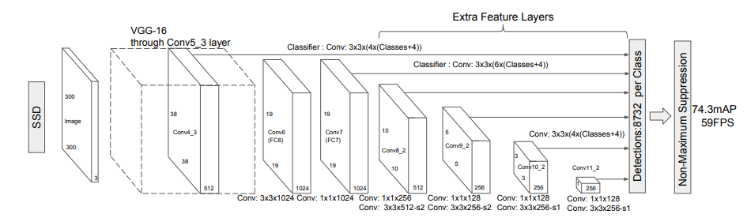
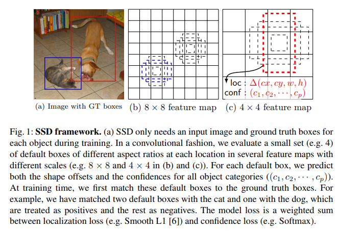
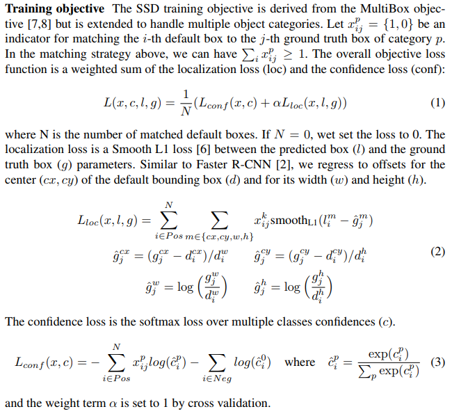
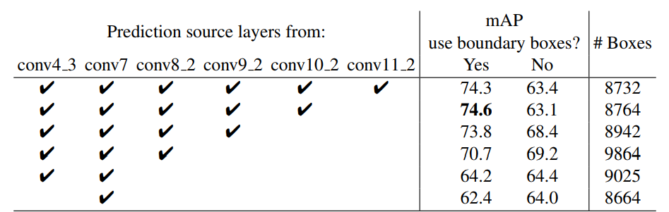

SSD: Single Shot MultiBox Detector
===

简介
---

SSD的主要贡献在于：
1. 提升了准确率和速度；
1. 提出了`default bounding boxes`的概念，使用小的卷积核对特征图进行卷积的代分类和位置的`便移`；
1. 从`base network`中的不同层抽取不同尺度的特征图，并使用不同宽高比进行预测；
1. 端到端的训练方式，在低分辨率的图像上也有很高的准确率。

框架
---

### 模型
模型图如下：

**特征提取网络**：使用`VGG16`作为前面的特征提取层，将`fc6`和`fc7`变成了卷积层，`fc6`和`fc7`之间的池化下采样操作从`2 x 2 - s2`变成`3 x 3 - s1`，并使用`atrous`算法来填充。不再使用`dropout`操作，并移除了`fc8`。

SSD基于前馈卷积网络，生成固定数量的边界框和这些框内包含目标的概率。紧接着使用`非最大值抑制(NMS)`的方法来得到最终的结果。
网络的前几层使用常规的结构来对高质量的图像进行分类，成为**base network**。其次，在后面增加一些辅助的结构，这些结构主要有以下特性：
1. **多尺度特征图**：在提取特征的网络后面又增加了几个卷积层，这些网络层逐渐的降低特征图的尺度，使得能够在更多的尺度上预测。在每个尺度上使用卷积模型进行预测是相互独立的。
1. **使用卷积进行预测**：对于每个新增的特征层，都能够使用卷积操作产生固定数量的预测结果。假设特征层的大小为`m x n`，拥有`p`个通道，那么就有`3 x 3 x p`个较小的卷积核来预测最终的结果。对于`m x n`的每个卷积操作的位置，都会产生一个结果。位置上，使用相对于`default box`的位置来确定的。
1. **default box和宽高比**：在特征提取网络的前几层，将特征图每个点和默认的边界框联系起来。默认的边界框使用卷积的方式将特征图进行平铺，那么每个预测框的位置和对应特征图中的点关系是确定的。在特征图的每个点上，给出该点对应default box的相对便移，同时给出每个分类的概率来表明该预测框存在该分类目标的可能性。特别的，对每个给定的位置，预测出`k`个框，每个框要计算给出`c`个分类的概率值以及框的`4`个点相对于default box的便移值。因此每个位置输出`(c + 4)k`个值，假设特征图为`m x n`，总计要输出`(c + 4)kmn`个值。

### default box

default box的示意图(图片来源于论文)如下：

如上图，有`8x8`和`4x4`的两种不同的特征图。特征图中的每个小格，都有相应的default box(图b的虚线标出)。使用不同的宽高比和不同的尺度。对于每个默认的边界框，像图c那样，预测出相对的位置和每个分类的置信度。在训练的时候，首先使用默认的边界框对每个`ground truth`进行匹配。例如，在图a中的猫和狗，在图b中使用两个默认的边界框进行匹配，这两个默认的边界框被认为是`positive`的，而其他的default box则被认为是`negative`的。
default box的改变和`Anchor`的概念是类似的。

### 训练

超参数设计：使用`SGD`优化器，学习率设置为`0.0001`，`0.9 momentum, 0.0005 weight decay`。

1. **匹配策略**：
  在训练过程中，需要确定那个默认的边界框和标注的边界框是对应的。对于每个标定的边界框，使用不同宽高比、不同尺度、不同的位置来进行匹配，选出`jaccard overlap`最大的那个值作为默认的边界框。然后，匹配到任何标注的边界框的`jaccard overlap`大于一定阈值也被看作是默认的边界框。由于不仅仅使用单一的default box，因此能够大大提高准确度。

1. **损失函数**：如下原论文中的描述：
  

1. **宽高比和尺度的选择**：
  使用不同大小的图像能够提高不同尺度目标的检测准确度。然后，利用不同层的特征图也能够达到相同的目的。RCNN使用区域推荐框，输入的图像的大小是不同的，因此能够解决该问题，但是这种方式不能够共享计算，因此效率较低。而从不同的层抽取不同尺度的特征，前面的计算是共享的，那么能够节省很多计算资源。同时，使用靠前的几层特征图能够提升计算准确度，这是由于卷积计算可能会丢失一些细节。因此，越靠前的层，语义信息越丰富。
  不同层的特征图拥有不同的感受野。但是对于SSD来说，默认的边界框不需要和不同的感受野一一对应。SSD将特征图进行平铺成向量来进行预测。default box的尺度对于不同的特征图来说是不同的。靠前抽出的特征图尺度为`0.2`，而最后抽取的特征图尺度为`0.9`，中间的层介于这之间，依次增大。宽高比使用`1, 2, 3, 1/2, 1/3`。关于详细的计算描述参考论文。更多的`default box`形状得出的结果更好。

1. **困难的反例**：
  使用上述的匹配策略，将会产生大量的`negative default box`。因此，训练的时候并不会使用全部的`default box`，而是大约将比例控制在`3:1`，这样能够更好的控制训练。

1. **数据增强**：
  为了能够使模型的鲁棒性更强，可以使用下面策略进行数据的增强：
    * 使用诠释的整张图像作为输入
    * 将图像进行采样，采样后图像中的目标和原始图像中的目标的`overlap`为`0.1, 0.3, 0.5, 0.7, 0.9`
    * 随机采样，采样的大小控制在`0.1 - 1`之间，宽高比在`1/2 - 2`之间。

结果
---

在结果上，SSD效果是优于之前的RCNN算法的。`SSD 300`在速度上有很大的优势，而`SSD 512`在精度上较好。对于一般的检测算法，`SSD 300`已经足够了。
对于模型的训练来说，使用全部的策略得出的模型是最好的，如下所示：

另外，对于使用不同层的特征图，使用多个不同的特征图的效果较好，对比结果如下：

