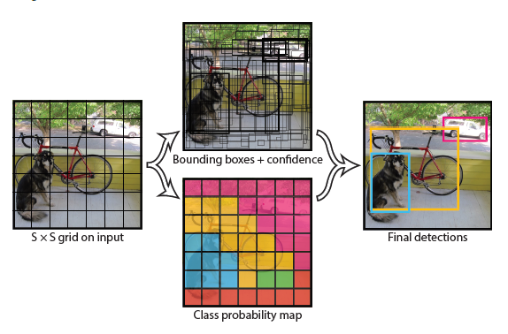
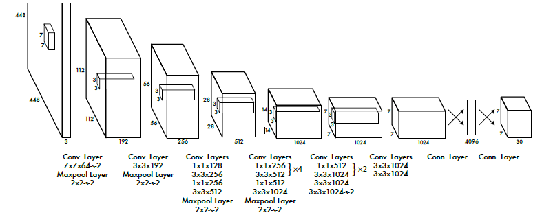

You Only Look Once
===

YOLOv1 arXiv: <https://arxiv.org/abs/1506.02640>

YOLOv2 arXiv: <https://arxiv.org/abs/1612.08242>

YOLOv3 arXiv: <https://arxiv.org/abs/1804.02767>

背景
---
首先，对于之前的R-CNN系列的检测方法，是多个步骤的：
1. 在图片中产生预选框；
2. 对每个预选框进行分类；
3. 对预选框进行提炼，去除重复的检测，并对预选框进行重新评分。

由于上述的步骤比较繁杂，因此对多阶段的检测任务而言，需要对每一步进行调优，便产生了调优困难的问题。
因此，YOLO产生了，YOLO使用单一的卷积网络，同时预测边界框和类别的可能性，是一种端到端的网络。YOLO主要具有以下特点：
1. 速度快，能达到实时的要求。由于去除了繁杂的任务，YOLO只需要端到端的训练和测试步骤，使得YOLOv1能够达到45fps，快速的版本则能够达到150fps。
1. 预测的时候，关注的是整张图像的特征，而不像滑动框那样仅仅是关注图像的某部分特征，因此能够包含更加丰富和全面的纹理特性。
1. YOLO能够学习目标的更加一般性的表示，能够更加宽泛的适合更多种类的图像。
1. YOLO在准确率上是较two-stage的算法低的，主要体现在边界框的准确度，尤其是小物体。

YOLO v1
---

### 框架
YOLO将图像分成$S \times S$的网格，每个网格给出$B$个候选框并针对每个候选框给出置信值。置信值反映了候选框包含目标的可能性以及候选框边界预测的准确程度。置信度定义为：$Pr(Object) \times {IOU}_{pred}^{thuth}$，也就是说当网格内不存在目标的时候，置信度为0，存在目标时，置信度为`IOU`。其实每个网格只负责目标的中心点落在该网格的目标。
每个候选框由5个参数构成：$(x, y, w, h, confidence)$。$(x, y)$表示相对于网格的中心点位置，$(w, h)$表示相对于整张图像的宽和高的比例。因此，这4个参数的值都是`0到1`之间。$confidence$表示候选框和任何ground truth的`IOU`。
另外，每个网格还给出`C`个分类的概率：$ Pr({Class}_i|Object) $，代表该网格存在该分类目标的可能性。在测试的时候，我们将其与上面的置信度相乘：$ Pr({Class}_i|Object) \times Pr(Object) \times {IOU}_{pred}^{thuth} = Pr({Class}_i) \times {IOU}_{pred}^{thuth} $，得到了对每个候选框，分类存在的可能性。
> 也就是说，将图像先分成$S \times S$的网格。然后每个网格预测出$B$个候选框(每个候选框有5个参数，表示位置和置信度)。同时，每个网格都给出$C$个分类存在的可能性。因此最终的输出为$S \times S \times (B \times 5 + C)$。参考下图

网络的结构如下：

网络使用$S = 7, B = 2, C = 20$来测试`PASCAL VOC`的数据集。
由于每个网格相当于只负责目标的中心点落在该网格的目标，而参数$B = 2$，也就是每个网格产生两个候选框，因此多目标中心点落在同一个网格中，效果会很差。同时，小的目标检测也会有很多的问题。

### 训练过程
1. 训练网络的前20个卷积层：仅仅使用前20个卷积层，后面另外加上`average-pooling layer`和一个`fully connected layer`进行训练，输入的图像为224x224。
1. 使用训练好的前20个卷积层，如上述的网络结构后面加上4个`convolutional layer`和2个`fully connected layer`，进行总体的训练，输入的图像采用448x448。

### 更多细节
1. 激活函数的使用：
  最后一层使用线性激活函数，其他层使用`Leaky-Relu`:
  $$
    \phi (x) =
    \begin{cases}
      x & x > 0 \\
      0.1x & x <= 0
    \end{cases}
  $$
1. 损失函数设计:
  $$
  \begin{equation}
  \begin{split}
    & \lambda_{coord}\sum_{i=0}^{S^2}\sum_{j=0}^B{\mathbb{1}_{ij}^{obj}[{(x_i-\hat{x}_i)}^2+{(y_i-\hat{y}_i)}^2]}\\
    & +\lambda_{coord}\sum_{i=0}^{S^2}\sum_{j=0}^B{\mathbb{1}_{ij}^{obj}[{(\sqrt{w_i}-\sqrt{\hat{w}_i})}^2+{(\sqrt{h_i}-\sqrt{\hat{h}_i})}^2]}\\
    & +\sum_{i=0}^{S^2}\sum_{j=0}^B{\mathbb{1}_{ij}^{obj}{(C_i-\hat{C}_i)}^2}\\
    & +\lambda_{noobj}\sum_{i=0}^{S^2}\sum_{j=0}^B{\mathbb{1}_{ij}^{noobj}{(C_i-\hat{C}_i)}^2}\\
    & +\sum_{i=0}^{S^2}{1}_{i}^{obj}\sum_{c \in classes}{{(p_i(c)-\hat{p}_i(c))^2}}
  \end{split}
  \end{equation}
  $$
  $\mathbb{1}_{i}^{obj}$表示第i个网格中有目标的情况下有效，而$\mathbb{1}_{ij}^{obj}$表示第i个网格的第j个推荐框有目标的情况下有效。
1. 学习率的设置策略：
    * 在前几个epochs的时候缓慢的将学习率从`1e-3`增加到`1e-2`，来防止学习率过大导致梯度不稳定。
    * 使用`1e-2`的学习率训练75个epochs。
    * 使用`1e-3`的学习率训练30个epochs。
    * 使用`1e-4`的学习率训练30个epochs。
1. 使用了dropout层来防止过拟合。

YOLO v2
---

### 改进方案
1. **Batch Noarmalization**：主要有两个优点，一个是提高了大约`2%`的*mAP*；二是不需要再使用`dropout`来防止过拟合。
1. **High Resolution Classifier**：在YOLO v1的训练过程中，使用224x224分辨率的图片进行初始化的训练，使用448x448分辨率的图片训练整个检测网络。而YOLO v2中使用`ImageNet`数据集，直接采用448x448分辨率的图片初始化前面的卷积网络，然后进行微调。大概提升了`4%`的*mAP*。
1. **Convolutional with Anchor Boxes**：卷积网络的后面不再使用全连接层来获得最终的位置和分类概率，而是借用了`Faster-RCNN`的**Anchor**机制，将分类的置信度和空间位置分离，对每个候选框分别回归得到方框的置信度和分类的置信度，提高召回率，但是准确度相对来说有很小的降低。
    出现了两个问题：
    * 候选框的尺寸需要手动选取；
    * 在训练迭代的初期阶段模型很不稳定。
1. **Dimension Clusters**：针对Anchor机制出现的第一个问题，采用`k-mean`的方法来选择较好的先验。如果仅仅用欧几里得距离的`k-mean`方法，大尺寸的边框较小尺寸的边框会产生更多的错误。因而，定义距离为：$d(box, centroid) = 1 - IOU(box, centorid)$。作者给出使用$k = 5$效果较佳。
1. **Direct location prediction**：这个是针对Anchor机制出现的第二个问题。其实大部分的不稳定性是由于预测的位置$(x, y)$不准确。由于Anchor机制的**RPN**的预测值计算如下：$$x = (t_x \times w_a) - x_a$$ $$y = (t_y \times h_a) - y_a$$
  这个公式是不受约束的，因此anchor box可能会出现在图像的任何位置，训练过程需要很长的时间才能稳定下来。因此，作者采用了相对于网格长宽的方式，使得**边界的值介于0到1之间**，并使用**对数的激活函数**来约束网络的预测以使得预测的值正好落在0到1之间。
  对于每个网格，预测出5个边界框。每个边界框有5个参数$(t_x, t_y, t_w, t_h, t_o)$，如果该网格的左上角点的位置为$(c_x, c_y)$，并且边界框的先验的宽和高为$p_w, p_h$，那么真实的边界框的信息如下：
  $ b_x = \sigma(t_x) + c_x \\ b_y = \sigma(t_y) + c_y \\ b_w = p_we^{t_w} \\ b_h = p_he^{t_h} \\ Pr(object) * IOU(b, object) = \sigma(t_o) $
  因此，通过对位置的约束，网络的训练就更加稳定了。
1. **Fine-Grained Features**：YOLO采用13 x 13的特征图，这对于大的目标是足够的，但是对于小目标来说，我们可能需要更加细粒度特征。像`R-CNN`和`SSD`都是使用`proposal network`在各种不同的特征图中获取一系列维度的特征。作者则是采用了不同的方法，将上一层的`26 x 26`的特征直接连接到输出层上。将`26 x 26`尺度的特征和`13 x 13`尺度的特征进行融合，是将`26 x 26 x 512`的特征变成`13 x 13 x 2048`的特征图，这样就能和低分辨尺度的特征图组合到一起。
1. **Multi-Scale Training**：在第一个版本中，图片的尺寸是固定大小的，而在这个版本中，使用多个尺度进行训练，每10个epochs变换一次尺寸。尺寸的大小都是32的倍数：{320, 352, ... 608}。这样更能增加模型的鲁棒性。
1. **使用`Darknet-19`作为分类网络**

YOLO v3
---

### 改进方案：
1. 使用`logistic regression`对推荐框的置信度进行回归，将先验与实际边界框`IOU`大于`0.5`的推荐框看作是正例。若有多个满足条件，仅仅使用最大的一个。
1. 不再使用`softmax`，而是使用`logistic classifier`作为分类的概率，同时使用`binary cross-entropy loss`作为分类的损失函数。这样能够解决很多目标重叠的时候分类不准的问题。
1. 多个尺度进行预测，作者使用了3种尺度：
    * 使用最后的输出进行预测；
    * 从最后输出的两个卷积层前获取特征，并使用`x2`的上采样，并从网络的前几层获取特征，并进行上采样，然后将不同的采样特征进行融合，然后使用卷积操作对融合的特征进行卷积操作，得出预测值。
    * 使用上述的方法在进行一次预测，这次根据前两次的先验结果并且从更靠前的层获取更加细粒度的特征。
  同样，还是使用`k-mean`的方式来确定最终的边界框。
1. 特征提取的网络采用`Darkent-53`

### 结果
* YOLO v3在进行多次改进之后，预测小目标的能力得到提升；
* 在保证准确率的前提下，速度能够更快。