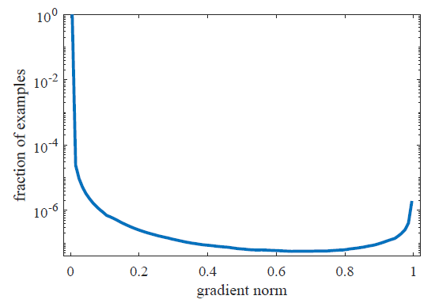
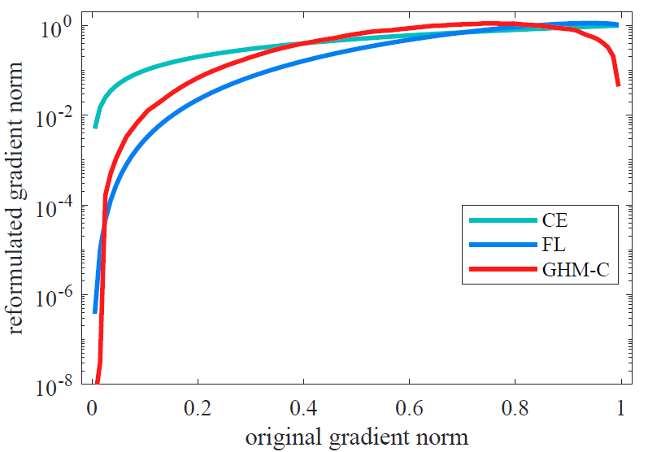
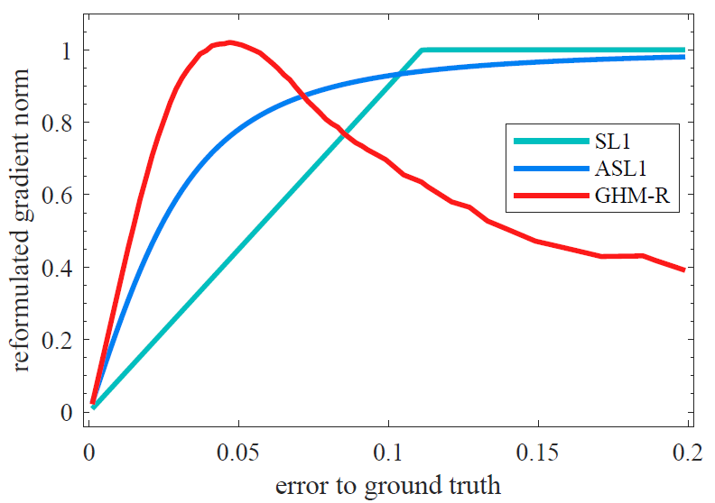

Gradient Harmonized Single-stage Detector
=========================================

arXiv：<https://arxiv.org/abs/1811.05181>

问题的提出
---------
目前检测大体分为两种方式：**two-stage**和**single-stage**。虽然**two-stage**方法能够达到很高的准确度，但是**single-stage**目前还面临两个主要的问题：1. *正样本的数量远远小于负样本的数量*，2. *复杂样本和简单样本之间的数量差距很大*。作业在此基础上，提出了和**cross-entropy**类似的分类损失函数，以及和**smooth-L1**类似的回归损失函数。

问题的解决
---------
如果一个正样本被正确的分类，那么这个样本就是一个比较简单的样本，但模型的收益相对较小，因此产生的梯度也是很小的。相对来说被错误分类的样本更应该收到关注来改善模型。

文章的主要贡献如下：
1. *one-stage*检测在**梯度范数分布**方面揭示了样本巨大差异背后的基本原理，并提出了**GHM**损失函数来解决这个问题。
1. 将**GHM**分为分类和回归两个函数，意味着能够更细致的调节两个梯度的贡献，以提高对于超参数的鲁棒性。
1. 使用**GHM**损失函数，可以不适用任何*数据采样策略*便能够达到COCO基准测试的最好结果。

### 梯度范数分布
对于一个候选框，令$p \in [0, 1]$来代表模型预测的概率，$p^* \in {0, 1}$来代表标签的值，对于**cross entropy**损失函数来说：
$$
L_{CE}(p, p^*) =
  \begin{equation}
    \begin{cases}
      -log(p) & p^* = 1 \\
      -log(1 - p) & p^* = 0
    \end{cases}
  \end{equation}
$$
假设模型的输出$p = sigmoid(x)$，对其进行求导有：
$$
\frac{\partial L_{CE}}{\partial x}=
  \begin{equation}
    \begin{cases}
      p - 1 & p^* = 1 \\
      p & p^* = 0
    \end{cases}
  \end{equation} \\
= p - p^*
$$
令$g = |p- p^*|$，就相当于对于$x$的梯度。同时，$g$的值也代表了样本的简单和困难的属性。下图显示了梯度范数在one-stage检测模型中的分布：

由于简单的负样本数量较多，因此纵坐标进行了取对数处理。从上图可以看出，简单样本的数目非常庞大，对整体的梯度有很大的影响，同时，收敛的模型依然很难处理复杂样本，而且复杂样本的数目是多于介于中间难度的样本。由于非常复杂的样本的梯度方向和其他样本的梯度方向相差较大，因此这样非常复杂的样本可以看作是孤立部分。也就是说，如果强制的学习这些孤立部分的分类，将会降低其他样本的准确度。

### 梯度密度
为了解决上述的梯度范数分布不均衡的问题，引入了梯度密度(**Gradient Density**)：
$$GD(g) = \frac{1}{l_\epsilon(g)}\sum^N_{k=1}{\delta_\epsilon(g_k, g)}$$
其中，$g_k$表示第k个样本。那么：
$$
\delta_\epsilon(x, y) =
  \begin{equation}
    \begin{cases}
      1 & y - \epsilon/_2 <= x < y + \epsilon/_2 \\
      0 &
    \end{cases}
  \end{equation}
$$
$$ l_\epsilon(g) = min(g + \epsilon/_2, 1) + max(g - \epsilon/_2, 0) $$
$g$的梯度密度表示在以$g$中心的规范化后的$\epsilon$长度范围内的样本的数量。那么，对于协调参数可以定义如下：
$$ \beta_i = \frac{1}{GD(g_i)/N} = \frac{N}{GD(g_i)} $$
其中N是样本的总体数量。上面所定义的协调参数，其实是第i个样本对于相邻的样本总体的一个规范化。假如，样本是服从*均匀分布*的，那么$GD(g_i) = N$，得到的协调参数为1，也就是说协调参数不起任何作用。但是，如果样本的梯度密度很大，那么经过规范化之后权重就会降低。

### GHM-C损失函数
分类的损失函数定义如下：
$$L_{GHM-C} = \frac{1}{N}\sum^N_{i=1}{\beta_iL_{CE}(p_i, p^*_i)} = \sum^N_{i = 1}\frac{L_{CE}(p_i, p^*_i)}{GD(g_i)}$$
下图，同样给出梯度范数的分布图：

从图中可以看出，简单样本和非常复杂的样本权重都被降低了，有效改善了分布不均衡的问题。同时，没有像*Focal Loss*那样，引入超参数，能够大大增强训练的便捷程度。

### GHM-R损失函数
模型回归预测的边界框为$t = (t_x, t_y, t_w, t_h)$，实际样本的边界框为$t^* = (t^*_x, t^*_y, t^*_w, t^*_h)$。通常使用的L1损失函数如下：
$$ L_{reg} = \sum_{i \in \{x, y, w, h\}}{SL_1(t_i - t^*_i)} $$
其中：
$$
SL_i(d) =
  \begin{equation}
    \begin{cases}
      \frac{d^2}{2\delta} & |d| <= \delta \\
      |d| - \frac{\delta}{2} & otherwise
    \end{cases}
  \end{equation}
$$
$\delta$是一次项和二次项的分界点，经常设置为1/9。对损失函数求导有：
$$\frac{\partial{SL_1}}{\partial{t_i}} = \frac{\partial{SL_1}}{\partial d} =
  \begin{equation}
    \begin{cases}
      \frac{d}{\delta} & |d| < \delta \\
      sgn(d) & otherwise
    \end{cases}
  \end{equation}
$$
上式中， 对于$|d|$而言，当大于分界点$\delta$的所有样本都有相同的梯度，即为1。将会意味着无法对样本根据梯度密度进行区分开。为了方便，在引入新的损失函数前，对L1损失函数进行改写：
$$ ASL_1(d) = \sqrt{d^2 + \mu^2} - \mu $$
该损失函数是真正的平滑的损失函数，在任何位置都具有梯度，其偏导数为
$$ \frac{\partial ASL_1}{\partial d} = \frac{d}{\sqrt{d^2 + \mu^2}} $$
梯度的范围是[0, 1)，这样关于区域的梯度密度的计算就变得简单了，而且设置$\mu = 0.02$还能够保持L1损失的性能。
下面便定义$gr = |\frac{d}{\sqrt{d^2 + \mu^2}}|$作为梯度范数，那么对于梯度范数的分布如下图：

可以看出，由于回归损失是对正样本进行计算的，因此大部分的样本都是处于孤立部分的。下面给出了GHM回归损失：
$$
L_{GHM-R} = \frac{1}{N}\sum_{i=1}^N{\frac{ASL_1(d_i)}{GD(gr_i)}}
$$
分布图如下：

> 边界框回归中，并不是所有的简单样本都是不重要的。简单样本在分类中经常是一个背景区域，会由于过低的评分而在最终的候选框中排除在外。因此，这类的样本对于预测的准确度是没有任何贡献的。但是在边界框回归的时候，简单样本和真实边界还是存在偏差的，更好的对任何样本进行预测将会直接的提升最终候选框的质量。而且，很多数据集目前更为看重边界的准确度。

总结
----
改论文针对*single-stage*检测中，样本不平衡的问题提出了两个损失函数GHM-C和GHM-R分别针对分类和回归问题。*single-stage*效果能够达到FPN和Mask-RCNN的效果。