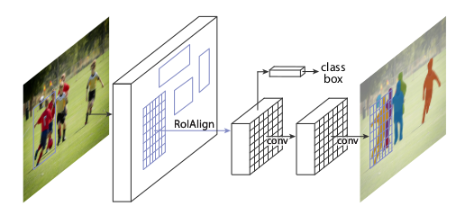
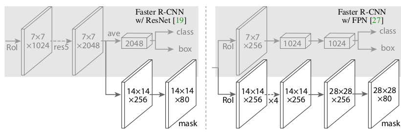
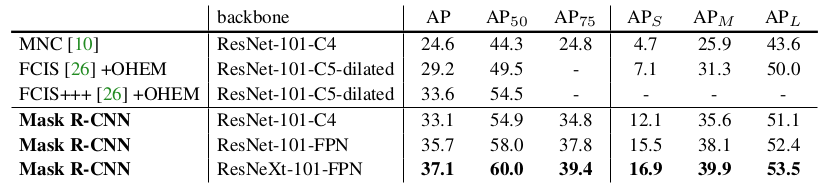

Mask RCNN
===

arXiv：<https://arxiv.org/abs/1703.06870>

基本介绍
---

Mask RCNN是由Faster RCNN增加了一个mask分支而来。

**Faster RCNN**分为两个阶段，第一个阶段使用特征图作为`RPN`的输入产生推荐区域；第二个阶段则使用产生的推荐区域和之前的特征图作为输入，通过`RoIPool`操作，将每个RoI区域的特征提取出来并`Resize`成相同的大小。将得到的每个RoI的特征分为两个分支，一个分支产生分类信息，另一个分支则给出位置信息。

**Mask RCNN**在Faster RCNN的基础上，将`RoIPool`操作替换成了`RoIAlign`操作，并在最后增加了产生mask信息的分支。

在准确度上，`Mask RCNN`在当时拥有很高的准确度。而在速度上，由于是对于Faster RCNN的扩充，在8个GPU上，只有5FPS。速度相对很低。

网络结构
---

网络基本结构如下图：

可以看出，Mask RCNN和Faster RCNN的网络机构基本相似。首先对整张图片使用卷及神经网络进行特征的提取，然后产生推荐的区域，最后对每个推荐区域，进行分类、边界框回归以及mask预测。

### 特征提取部分

作者尝试使用了如下几种特征提取网络：
* ResNet： 原始的Faster RCNN使用ResNet作为特征提取的网络，使用第四个阶段的最后的卷积层（`C4`）作为特征图的输出，合称为`ResNet-50-C4`。
* ResNeXt

并使用具有横向连接的自上而下的网络架构，从单一尺度输入构建特征金字塔网络来从不同的网络层抽取丰富的特征信息。因此Mask RCNN使用`ResNet-FPN`作为特征提取网络，能够在性能和精确度上都有很好的结果。

对于**Head Architecture**来说，作者提出两种方式如下图所示：

* 左侧：`ResNet-C4`作为特征提取网络应该包含ResNet的第9层`res5`，是计算密集的。
* 右侧：对于FPN来说，特征提取网络已经包含了`res5`，因此可以使用较少的层来更方便的实现特征提取的工作。
* 除了输出使用`1x1`卷积层以外，所有的卷积层使用`3x3`的卷积核。反卷积层使用`2x2`卷积核，步长为`2`。使用`ReLU`作为每个层的激活函数。

重要思想
---

### RoIAlign

Mask RCNN提出了**RoIAlign**来代替**RoIPool**操作，主要的优点是：
1. 对于`mask`的准确度，相对的从`10%`提升到`50%`，因此对位置要求较高的场景下，增益较高；
1. 对于`mask`和`class`的预测，分离是十分有必要的：对每个分类独立的预测一个二分类的`mask`，而不是使用`softmax`那样来根据分类的概率确定`mask`。分类信息最终由分类的分支确定。
以上的两个优点相对于使用多分类概率确定`mask`来说能够提高很大的准确率。

关于RoI操作的对比：
* **RoIPool**：给定特征图，首先对浮点数边界做量化操作，然后根据量化结果划分区域，对每个区域内经常使用最大值操作得到最终的结果。对于边界的量化操作通常会导致错位的问题，由于分类问题对位置的信息并不敏感，但是像素界别的分割问题就会有很多的问题。
* **RoIAlign**：移除了量化的部分，而直接使用浮点值。假设原图像大小为`800x800`，经过一系列的特征提取，输出的特征图为`25x25`。那么对于`655x655`的推荐区域，映射到特征图中大小为`20.78x20.78`。最终需要固定成`7x7`的特征图，需要将映射的`20.78x20.78`的推荐区域划分成49等大小的区域，每个区域的大小为`2.97x2.97`。假设采样点为4，那么就要对`2.97x2.97`的小区域平分4份，每份取中点位置的像素，采用双线性插值方式进行计算，这样就得到4个采样值，然后取4个采样值的最大值或者平均值作为最终的特征。

结果
---

